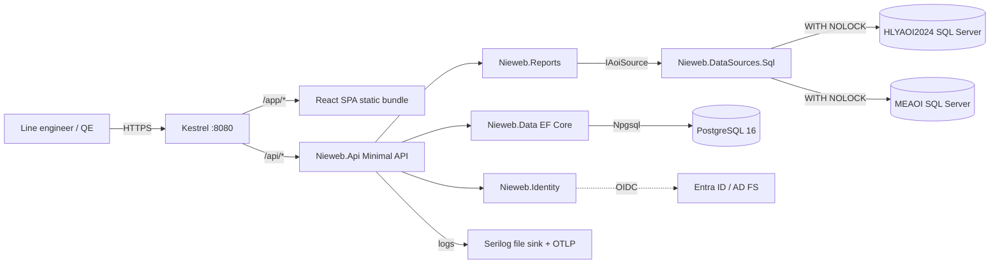

# Phase 1 MVP — vertical slice

_Status: **PROPOSAL** — awaiting sign-off._
_Depends on: `docs/tech-stack.md` (SIGNED-OFF 2026-07-20)._

## 1. Purpose

Ship **one report end-to-end** with the full production stack wired up, so
that:

1. Every layer chosen in the tech-stack doc is exercised in a realistic way
   (React SPA → JSON API → SQL adapter → live Superviseur DB, with auth,
   i18n, logging, CI/CD, deployment).
2. Line engineers can start using Nieweb for at least one real question
   they ask every day.
3. Every remaining Vieweb / Sigmalink feature reduces to "add another
   report on top of this vertical slice".

**Not** the goal: feature parity with Vieweb (that's Phase 2). Not the
goal: pretty. Not the goal: performant at 1000 concurrent users.

---

## 2. The single feature: **"Panel Yield by Line" report**

A line engineer or quality engineer picks:

- **Source** — post-reflow (HLYAOI2024) or pre-reflow (MEAOI)
- **Date range** — a start & end datetime (defaults to "last 7 days
  ending at the source's latest panel", using
  `IAoiSource.GetLatestPanelUtcAsync`)
- **Machines** (optional multi-select) — production lines to include
- **Products** (optional multi-select)

…and sees:

- **Bar chart** — FPY Diagnostic (%) per machine, one bar per line, sorted
  descending, colour-coded green/amber/red at configurable thresholds
- **Table** — one row per (Machine, Product) combination, columns:
  Machine name, Product name, panels inspected, panels good (status ∈
  {1,2,3}), panels faulty (status ∈ {-2,-1}), panels not-inspected
  (status = 0), FPY Diagnostic %, FPY AOI %
- **KPI header** — total panels, overall FPY Diagnostic %, source freshness
  ("last panel: 2026-07-20 00:02Z, 45 minutes ago")

Users can:

- **Save the filter** as a named "view" (persisted in Nieweb internal DB)
- **Export** the table as CSV or XLSX
- **Print** the page (browser print CSS)
- **Share** a URL — filters live in query-string, deep-linkable
- **Switch language** (EN / FR) via a header dropdown, persisted per user

### Why this report first

- Uses only PANELS (already implemented in the SQL adapter — no new fact-
  table plumbing needed).
- FPY is the single most-cross-checked KPI on the line, so numeric parity
  with Vieweb is easy to verify and impossible to fake.
- Works on both sources, exercising the capability-flag / multi-source
  registration story.
- Naturally leads into Phase 2 reports: swap `PANELS` for `CARDS`, swap
  FPY for DPMO, swap the bar chart for a Pareto, and you've got the next
  four Vieweb reports for free.

### Explicitly out of scope for MVP

- Automatic treatments (scheduled runs, email delivery). Phase 2.
- MSA / Process Capability / Traceability reports. Phase 2.
- Review UI. Phase 2.
- PDF export. Phase 2 (CSV + XLSX is enough for MVP).
- Sigmalink Analyse dashboards. Phase 3.
- Editing users' own passwords via UI for OIDC users (they use Entra).
  Local-account admin CRUD is in.

---

## 3. Success criteria (definition of done)

1. **Numeric parity.** For a fixed 30-day window on HLYAOI2024, Nieweb's per-
   machine panel counts, "good" / "faulty" / "not inspected" splits, and
   FPY percentages match hand-computed values from raw SQL within
   rounding error. Snapshot test proves it in CI.
2. **Performance.** First page render (empty filter → default 7-day view)
   under **1.5 s p95** on the target Windows Server against a warm SQL
   Server. Table page-load (any filter change) under **500 ms p95**.
3. **Read-only discipline preserved.** Every SQL statement Nieweb issues
   against a Superviseur DB is captured in the audit log with source tag,
   duration, and row count. Zero write statements ever appear.
4. **Deploys as a Windows service** from a `dotnet publish` artifact + the
   built React bundle. `sc start Nieweb` brings the site up on port 8080;
   `sc stop Nieweb` shuts it down cleanly within 5 s.
5. **Two design partners** (line engineers) have used it for at least one
   real question they wouldn't have used Vieweb for.
6. **CI is green** on every push to `main`: `dotnet build`, `dotnet test`,
   `npm ci && npm run build && npm run lint && npm run test`, plus one
   Playwright end-to-end smoke.
7. **Docs.** `README.md` explains local dev bring-up in <10 minutes on a
   fresh Windows box. `docs/deploy.md` explains production install.

---

## 4. New components coming online

| Project | Purpose |
|---|---|
| `src/Nieweb.Api/` | ASP.NET Core Web API host. Minimal API endpoints + Serilog + OpenTelemetry + health probes. Registers `IAoiSource` implementations from `appsettings.json`. Serves the React bundle from `wwwroot/`. |
| `src/Nieweb.Data/` | EF Core internal-DB context. Entities: `User`, `Role`, `UserRole`, `AuditEvent`, `SavedView`. Postgres provider in prod, SQLite in dev. Migrations checked into git. |
| `src/Nieweb.Identity/` | ASP.NET Core Identity + `Microsoft.Identity.Web` wiring. Login pages, admin account-management pages (server-rendered Razor — no need to bring these into the SPA), password reset flow. |
| `src/Nieweb.Reports/` | Report abstractions + the concrete **PanelYieldByLine** report. Pure functions from `IAoiSource` + filter DTO → aggregated result DTO. Zero SQL — reuses `IAoiSource.QueryPanelsAsync` / `StreamPanelsAsync`. Snapshot-tested for numeric parity. |
| `src/Nieweb.Web/` | React 19 + TypeScript + Vite SPA. TanStack Router (`/`, `/report/panel-yield`, `/admin/users`, `/login`), TanStack Query, Mantine v7, ECharts, react-i18next (en, fr). Built as static assets copied into `Nieweb.Api/wwwroot/`. |
| `tests/Nieweb.Reports.Tests/` | xUnit + FluentAssertions. Snapshot fixtures for FPY / count parity. |
| `tests/Nieweb.Api.Tests/` | xUnit + `WebApplicationFactory`. In-memory API tests against SQLite. |
| `tests/Nieweb.E2E/` | Playwright for .NET. One happy-path smoke: log in → open report → change date range → export CSV. |
| `.github/workflows/ci.yml` | Windows-hosted CI running the four gates above. |

`Nieweb.DataSources` and `Nieweb.DataSources.Sql` stay as-is.
`tools/db-smoke` stays as a developer utility.

---

## 5. User stories

**Line engineer — "How did my line perform overnight?"**
> Log in with my Entra account → land on the Panel Yield by Line page →
> the default filter is "last 7 days on post-reflow" → I change the range
> to "yesterday 07:00 → today 07:00" → I filter to my line only → I see
> FPY, panel count, and defect count → I export the table as CSV to share
> in the morning meeting.

**Quality engineer — "Where should we focus this week?"**
> Log in → open the report → set the range to "this week" on pre-reflow
> → sort the bar chart by FPY ascending → screenshot the lowest three
> lines → save the filter as "weekly quality review".

**Admin — "New quality technician started today."**
> Log in → Admin → Users → New local user → enter username, email, set
> "must change password on next login" → assign role `Reader` → click
> Save → new user gets an emailed invitation link.

---

## 6. Architecture overview

Everything left of the dotted OIDC line ships in the MVP artifact.

---

## 7. Backlog

Ordered by dependency, sized in T-shirts. Nothing here is estimated in
time — sequence matters more than clock estimates.

### 7.1 Foundation (S)

- `S1` — Solution folder layout: create empty `Nieweb.Api`, `Nieweb.Data`,
  `Nieweb.Identity`, `Nieweb.Reports`, `Nieweb.Web`; wire into `.slnx`.
- `S2` — `.editorconfig` at repo root; `dotnet format` in CI.
- `S3` — Root `.github/workflows/ci.yml` runs `dotnet build` + `dotnet
  test` on Windows.
- `S4` — Serilog + OpenTelemetry base config, structured JSON to
  `logs/nieweb-{Date}.log`.

### 7.2 Internal DB & Identity (M)

- `D1` — `NiewebDbContext` + initial migration: `User`, `Role`, `UserRole`,
  `AuditEvent`, `SavedView`.
- `D2` — Dual-provider setup (Npgsql in Production, Sqlite in Development)
  with matching migrations.
- `I1` — Wire ASP.NET Core Identity to `NiewebDbContext` with Argon2id
  password hashing.
- `I2` — Wire `Microsoft.Identity.Web` for OIDC (Entra ID).
  Auto-provision on first sign-in as `Reader`.
- `I3` — Login / logout pages (server-rendered Razor).
- `I4` — Admin account-management pages (server-rendered Razor):
  list / create / edit / delete local users; list / edit-role / disable
  OIDC users. Every action writes an `AuditEvent`.

### 7.3 Data-source registration (S)

- `A1` — `AoiSourceOptionsProvider` reads `appsettings.json → Nieweb:
  Sources: [ { id, displayName, envVarPrefix, enabled } ]`, loads
  `.env` (thin 40-line loader), instantiates `HlyaoiSource` /
  `MeaoiSource`, registers as keyed `IAoiSource`.
- `A2` — `/api/sources` endpoint returns each enabled source's
  `Descriptor` + `Caps` + latest-panel timestamp.

### 7.4 Reports slice (M)

- `R1` — `PanelYieldByLineReport` in `Nieweb.Reports`: pure function from
  `(IAoiSource, FilterDto)` → `PanelYieldResultDto` (KPI header + rows +
  per-machine breakdown), aggregating with `StreamPanelsAsync` so it
  scales past a single page.
- `R2` — Snapshot tests: three fixed windows on HLYAOI2024 + three on MEAOI
  → JSON snapshots checked into repo, compared byte-for-byte in CI.
- `R3` — `/api/reports/panel-yield` endpoint: takes filter as
  query-string, returns `PanelYieldResultDto`.
- `R4` — CSV export endpoint: `/api/reports/panel-yield/export.csv?…`
  streams from `System.IO.Pipelines`.
- `R5` — XLSX export endpoint via ClosedXML.

### 7.5 Frontend (M)

- `F1` — Vite + TS + React 19 project skeleton under `src/Nieweb.Web/`.
  Build output copied to `Nieweb.Api/wwwroot/` on publish.
- `F2` — TanStack Router (`/`, `/report/panel-yield`, `/login`) +
  TanStack Query + Mantine v7 theme + Zustand global store.
- `F3` — react-i18next with EN + FR bundles. Every string i18n-keyed
  from day one.
- `F4` — Source-picker + date-range + machine multiselect + product
  multiselect (all filter state in the URL).
- `F5` — ECharts bar chart with configurable FPY thresholds (defaults:
  green ≥ 99.5, amber 98.0–99.5, red < 98.0).
- `F6` — Mantine data table with sort + pagination + column export.
- `F7` — KPI header cards (total panels, overall FPY, source freshness).
- `F8` — Saved-views UI (list / save / delete named filters).
- `F9` — Print CSS.

### 7.6 Deployment & ops (S)

- `O1` — `dotnet publish -c Release -r win-x64 --self-contained false`
  produces a runnable artifact.
- `O2` — `install-service.ps1` / `uninstall-service.ps1` register /
  unregister with `sc.exe`, using
  `Microsoft.Extensions.Hosting.WindowsServices`.
- `O3` — `/health/live`, `/health/ready`, `/health/db` endpoints.
- `O4` — `docs/deploy.md`: production install steps.

### 7.7 Test coverage (S)

- `T1` — `Nieweb.Api.Tests` with `WebApplicationFactory` — auth,
  filters, error responses.
- `T2` — Playwright end-to-end smoke.

### 7.8 Design-partner integration (S, ongoing)

- `P1` — Recruit 2 line engineers.
- `P2` — Weekly 30-minute demo & feedback slot.
- `P3` — Feedback log in `docs/design-partner-log.md`.

---

## 8. Risks & mitigations

| Risk | Mitigation |
|---|---|
| Numeric mismatch with Vieweb on FPY | Snapshot tests **and** a reconciliation script that runs Nieweb's aggregation vs. a hand-written raw SQL query on the same window and diffs the output. |
| React SPA + auth cookie interactions in a Windows service (SameSite / secure-flag surprises) | Test both HTTPS and HTTP-behind-proxy in a staging box before demoing to line engineers. |
| Entra ID app registration blocked / slow on IT side | Local-account path is fully functional in isolation, so we can ship the MVP with local accounts if OIDC is delayed. |
| HLYAOI2024 post-reflow performance impact | HLYAOI2024 is on the SMT-line critical path. Every AOI query is time-windowed, TOP-limited, `WITH (NOLOCK)`, and hard-capped at 30 s. All queries are logged (SQL tag + duration + row count) so slow ones surface immediately. |
| Design partners disengage | Weekly 30-minute cap; write down every request so contributions feel acknowledged even when deferred. |
| SQL Server test container too slow in CI | Fall back to `.bak` restore or run integration tests against a shared dev SQL Server instance behind a feature flag. |

---

## 9. What Phase 2 picks up immediately after

- Add DPMO reports (needs `CARDS` + `TESTED_OBJECT` queries → implements
  `QueryCardsAsync` and `QueryTestedObjectsAsync` in the base class,
  same shared-implementation pattern).
- Add MSA and Process Capability (needs `PIN` / `PIN_MEASURE` — post-
  reflow only, gated by `Capabilities.PinLevel`).
- Add Traceability (needs `Barcode_Product` view — post-reflow only,
  gated by `Capabilities.BarcodeProductView`).
- Automatic treatments (Quartz.NET job scheduler + email via MailKit).
- PDF export (QuestPDF).
- Production lines & shifts (new entities in `Nieweb.Data`).

Every one of those is a "same shape as MVP, different aggregation" story.

---

## 10. Ready-to-start checklist

Before writing the first line of `Nieweb.Api` code:

- [ ] Tech-stack signed off ✅ (2026-07-20)
- [ ] This MVP scope signed off (**awaiting your ✔️**)
- [ ] Ops has provisioned an Entra ID app registration (or we accept
      MVP-with-local-only)
- [ ] Two design partners recruited (or explicit "recruit during
      sprint 1")
- [ ] PostgreSQL 16 dev instance available (or accept SQLite-only until
      later)
