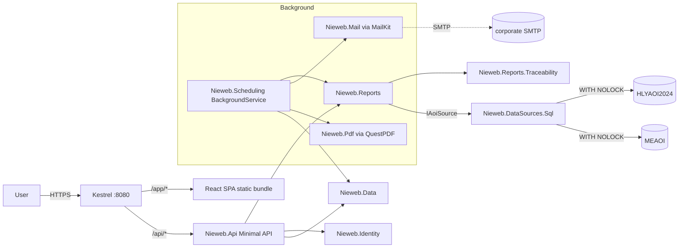

# Phase 2 — feature parity with Vieweb 1.6.2

_Status: **IN PROGRESS** — report infrastructure (§7.1), FPY table
(§7.2 TR1), DPMO table + Pareto server side (§7.2 TR2), Pareto SPA
page (§7.3 CR1), DefectBitDecoder + #11211 (§7.8), and corporate
branding (§11.2) have shipped. See §7 for the per-item status snapshot._
_Depends on: `docs/tech-stack.md` (SIGNED-OFF 2026-07-20)._
_Successor of: `docs/phase-1-mvp.md`._

## 1. Purpose

Phase 1 shipped a single report end-to-end plus the full production
stack (auth, i18n, deployment, CI, audit). Phase 2 uses that vertical
slice as a template to reach **numeric feature parity** with the
Vieweb 1.6.2 report catalogue so line and quality engineers can retire
the legacy Tomcat 7 install.

Non-goals (deferred to Phase 3): the Sigmalink CAD editor, real-time
feedforward (SigmaLine), full Review / repair workflow, and the four
Sigmalink Analyse dashboards. Those are large enough to deserve their
own phase document.

---

## 2. Scope

### 2.1 Vieweb entity types delivered

Vieweb organised every report as one or more **entities** of the
following types (see the `vieweb-legacy` skill for the full domain
model). Phase 2 delivers Nieweb equivalents of the four that carry
production-critical KPIs plus the two supporting types:

| Vieweb entity | Nieweb report | KPI source | Uses |
|---|---|---|---|
| `templatetable` (FPY / DPMO) | **FPY table** (per AOI / product; panel or board) + **DPMO table** (per AOI / defect / JEDEC / part number / product / reference designator) | `PANELS`, `CARDS`, `TESTED_OBJECT` | Quality reviews, morning meetings. |
| `templategraph` (Error / Deviation / Trend) | **Pareto** error chart (top-N defects by day / shift / top-10), **Deviation** chart (X / Y / Z / surface / theta with ±tolerance / average / ±3σ overlays), **Trend** chart (Cp, Cpk, DPMO*, FPY* over 1h / 3h / 6h / 12h / shift / day / week / month) | `TESTED_OBJECT`, `PIN`, `PIN_MEASURE` (post-reflow only) | Line-side troubleshooting, drift detection. |
| `templatemsa` (Capability / Repeatability / Reproducibility) | **Deferred** — MSA requires a dedicated Superviseur DB fed with empty-panel inspections that is not yet commissioned on site. Revisited when that DB is available. | — | — |
| `templateprocesscapability` | **Process Capability** dashboard per production line (Cp/Cpk compo & paste rows use a placeholder when no MSA source is bound; DPMO, FPY_Diag, Machine efficiency, Avg cycle duration, Nb inspections always render) | `PANELS`, `CARDS`, `TESTED_OBJECT` grouped by `PRODUCTION_LINE` | Weekly line reviews, Six-Sigma tracking. |
| `templatecomment` | **Comment block** entity (free-text, included in exports) | — | Report narration. |
| `TracabilityEntity` | **Traceability** drill-down (panel-level → subpanel → tested object → pin, plus per-board views) | All PANELS / CARDS / TESTED_OBJECT / PIN | Genealogy questions ("where did this board go?"). |

`TestEmptyMasterEntity` is intentionally out of scope: it requires a
dedicated Superviseur DB fed with empty-panel inspections and no
Nieweb user has asked for it in the design-partner interviews. The
MSA report shares that dedicated-DB requirement and is therefore
deferred alongside it (see §10 Q1).

### 2.2 Cross-cutting features

- **Reports & report groups.** A *report* is a saved bundle of
  entities + filters + layout. *Report groups* organise them in the
  home page navigator. Both are per-user; Author role can share.
- **Filters.** Reproduce the Vieweb filter grammar (see `vieweb-legacy`
  §Features/Filter operators): `Equal`, `Different`, `In`, `Not In`,
  `Like`, `Not Like`, `Between`, `Not Between`, `≤`, `≥`. Board number
  / panel bar code / board ID code / reference designator / product /
  JEDEC / P&P machine / P&P sub-element 1–4 / part number / inspected
  object / repair status / default / repair comment / panel status /
  board status / AOI. `IN` uses `;` as separator.
- **Locked reports.** Author can password-lock a report; the password
  blocks editing / deletion only. **Anyone can `Duplicate` a locked
  report without the password** (parity with Vieweb), and the copy is
  owned by the duplicator with no lock inherited.
- **Print.** Server renders a printable page (already done for
  Panel-Yield in F9); extend the same pattern to every entity.
- **Excel export.** One tab per entity; skip comment entities. XLSX
  via ClosedXML (already wired in R5).
- **CSV export** per entity table (already done for Panel-Yield).
- **PDF export.** New. Recommend **QuestPDF** — MIT, pure C#,
  render-server-side; wire the same layout data used by print CSS.
  Uses the **fixed corporate template** described in §11 (Nieweb
  header logo + BSS Green Premium sub-brand under it, footer with
  page N of M + generation timestamp + user). Vieweb's per-report
  header/footer slot configuration is dropped.
- **Automatic treatments.** Daily / weekly / monthly scheduled runs
  of a saved report; each run can email the Excel attachment via SMTP
  and/or write it to a configured directory. Two independent switches
  (Vieweb only had the global one — we add the per-treatment flag as
  the modern norm): a **global** `Nieweb:Batch:Enabled` master switch
  (parity with Vieweb `batchIsOn`), plus a per-`AutomaticTreatment`
  `IsEnabled` flag. A run fires only when both are on. Refresh
  frequency default 1440 min = 24 h. See §5.
- **Application parameters.** Tolerance intervals (`ITx`, `ITy`,
  `ITS` for pads + components); `GR_R` constant (default 4.33);
  confidence coefficient. Managed in the admin UI; persisted in the
  Nieweb internal DB. See `aoi-quality-metrics` skill for the formulas
  — do NOT re-derive. **MSA thresholds** (Acceptable / Out for
  Average, StdDev, 6σ, Cp, GR&R, EV, %EV on Deviation X / Y / Theta)
  are deferred with the MSA report itself.
- **Production lines & shifts.** Admin-managed logical grouping of
  machines into production lines (with order + category + image), plus
  24-hour shift breakpoints (Vieweb `shiftunit`). Needed by Process
  Capability and the "By shift" axis of the Error chart.
- **Home page.** User picks the subset of reports pinned to their
  dashboard (Vieweb `user_report`).

### 2.3 Fixes for legacy known bugs

Explicit acceptance test in Phase 2 CI:

- **#9699** — email delivery must succeed for every scheduled report
  or surface a clear error in the automatic-treatment audit row.
- **#12421** — weekly report totals must equal the sum of the daily
  totals over the same window (round-trip test).
- **#11211** — defect-name lookup must key on the exact
  `Error_Table` / `Error_Table_AR` bit that fired, not a positional
  join. Snapshot test on a fixture with several concurrent defect
  bits.
- **#18915** — no 250-column cap on any export; reproduce a >250-
  column DPMO table and verify XLSX + CSV both round-trip cleanly.

---

## 3. Success criteria (definition of done)

1. **Numeric parity.** For each report type, fixed reference windows
   on both Superviseur DBs produce KPI values within rounding error
   of hand-computed values from raw SQL (snapshot-tested in CI, same
   pattern as R2).
2. **Bug fixes verified.** #9699 / #12421 / #11211 / #18915 have
   dedicated regression tests that would have caught the legacy
   behaviour.
3. **Scheduled runs.** A weekly automatic treatment scheduled at
   Monday 06:00 for the last full week runs unattended for four
   consecutive weeks against the staging DB and emails / saves the
   XLSX every time.
4. **Read-only discipline preserved.** No new code path writes to
   either Superviseur DB. Every SQL statement is still captured in
   the per-query audit log with source tag, duration, and row count.
5. **CI green** on every push: `dotnet build`, `dotnet test`,
   `npm ci && npm run build && npm run lint && npm run test`, one
   Playwright end-to-end smoke covering each report type.
6. **Docs.** `docs/phase-2.md` (this document) supplemented by
   `docs/reports.md` — one section per report type describing the
   underlying SQL and the KPIs it computes.

Explicitly **not** a success criterion: matching Vieweb's UI pixel-
by-pixel. Phase 2 targets the Mantine + ECharts idiom already
established in Phase 1.

---

## 4. New components coming online

| Project | Purpose |
|---|---|
| `src/Nieweb.Reports/` | Grows to hold every report class. Each report is a pure function from `(IAoiSource, FilterDto, AppParameters)` → typed result DTO. |
| `src/Nieweb.Reports.Traceability/` (new) | Panel → board → object → pin drill-down; kept separate because it exercises the optional `IPinLevelSource` capability and is post-reflow only. |
| `src/Nieweb.Scheduling/` (new) | Automatic-treatment scheduler. Built on `Microsoft.Extensions.Hosting.BackgroundService`; persists next-run timestamps in the internal DB (`AutomaticTreatment` table). Skips runs when the master switch is off or the per-treatment `IsEnabled` flag is off (parity with Vieweb `batchIsOn` plus a modern per-row toggle). |
| `src/Nieweb.Mail/` (new) | SMTP client wrapper around `MailKit`. Delivery is idempotent per `(treatmentId, runTimestamp)` — retries do not duplicate. |
| `src/Nieweb.Pdf/` (new) | QuestPDF layout templates implementing the fixed corporate template described in §11 (header + sub-brand + footer). Shared across every report type. |
| `src/Nieweb.Web/` | Grows: one route per report type plus admin pages for report groups, automatic treatments, production lines, shifts, tolerance intervals. |

The internal-DB schema (`Nieweb.Data`) gains:

- `Report` + `ReportGroup` + `ReportEntity` (an entity slot inside a
  report, referencing one of the six entity types via a discriminator).
- `Filter` + `FilterValue` (multi-value IN / BETWEEN).
- `AutomaticTreatment` (frequency, next-run, mail-flag, file-flag,
  `IsEnabled` per-treatment flag, FK to `Report` and `User`, plus
  per-run audit rows).
- `EmailRecipient` (m:n on `AutomaticTreatment`).
- `ProductionLine` + `LineMachine` + `Shift`.
- `AppParameter` (typed key/value; tolerance intervals, GR\_R,
  confidence coefficient live here; MSA thresholds land alongside
  them when the MSA report is undeferred).
- `HomeReport` (per-user pinned subset).

Every new entity is created via EF Core migrations (same dual-provider
Npgsql/Sqlite story as Phase 1).

---

## 5. Automatic treatments — design brief

- **Trigger.** `BackgroundService` wakes every N minutes (default 5;
  configurable, matches the Vieweb minimum granularity). It runs any
  treatment whose `NextRunUtc ≤ now && isEnabled && globalBatchEnabled`.
  Both switches must be on — the global switch is an ops kill-switch;
  the per-treatment flag is the day-to-day owner control.
- **Isolation.** Each run happens in its own scope with a fresh
  `NiewebDbContext`. Long-running SQL against the Superviseur DBs is
  guarded by the same `SqlServerAoiSourceBase` read-only discipline
  (`WITH (NOLOCK)`, 30 s timeout, per-query audit log, cancellation
  token propagates).
- **Rescheduling.** On success, `NextRunUtc` is advanced by the
  frequency; on failure, it is advanced too (so we don't hot-loop) and
  a `TreatmentFailed` audit row is written with the exception summary.
- **Delivery.** File output writes to a configured directory
  (`Nieweb:BatchOutputDirectory`, default `%ProgramData%\Nieweb\batch`).
  Email delivery goes through `Nieweb.Mail`. Both actions are
  independent: a treatment may enable neither, either, or both.
- **Master switch.** Global `Nieweb:Batch:Enabled` in the internal
  `AppParameter` table (parity with Vieweb `batchIsOn`). Admin UI
  toggles it. In parallel, each `AutomaticTreatment` row carries
  its own `IsEnabled` flag that the owning Author can toggle without
  Admin rights.
- **Concurrency.** Only one instance of a given treatment runs at a
  time (row-level lease with `SELECT ... FOR UPDATE SKIP LOCKED` on
  Postgres; equivalent guard on SQLite via a service-wide
  `SemaphoreSlim`).
- **Bug #9699 mitigation.** Every delivery attempt is a first-class
  audit row (`automatictreatment.delivery.ok`,
  `automatictreatment.delivery.failed`) with the SMTP transcript
  (headers only) attached. The admin UI surfaces failed treatments so
  they can't silently rot.

---

## 6. Architecture overview

The Phase 1 architecture stays intact — Phase 2 grows sideways
(more report projects, a scheduler, mail/PDF sidecars) rather than
rewiring existing layers.

---

## 7. Backlog

Ordered by dependency, T-shirt sized. Nothing here is estimated in
time — sequence matters more than clock estimates.

**Status legend.** Each item is annotated with one of:
`✅ done <sha>` — merged, tests green;
`🟡 partial <sha>` — some sub-items delivered, follow-ups called out;
`⬜ open` — not started.

**Progress snapshot (2026-07-21).** Report infra (§7.1) is fully
landed. Table reports (§7.2) are landed on the server + export
layers; the frontend and the #18915 regression are the remaining
gap. Chart reports (§7.3): Pareto (`CR1`), Deviation (`CR2`) and
Trend (`CR3`) are all shipped end-to-end on the server + endpoint
layers — the shared time-decomposition selector (`F12`) and the
per-chart frontend tiles are the remaining gap. Report composition
(§7.6): `RC1` is landed — entities, migrations, `IReports`
service and admin CRUD are all in place, and `ReportEntity`
collapses Vieweb's six report-entity subclasses into a
`(TileType, ConfigJson)` pair so RC2's editor can pick from a
data-driven tile catalogue. RC2 (SPA editor) is the next open
item in §7.6. Nothing else in §7.4 – §7.11 has code yet.

### 7.1 Report infrastructure (M)

- `RI1` ✅ done `b388960` — Extract the Phase-1 `PanelYieldByLineReport`
  pattern into a shared `IReport<TInput,TOutput>` contract with
  snapshot-test scaffold (`Nieweb.Reports.TestKit`).
- `RI2` ✅ done `8b3ee1d` — `Nieweb.Reports.Common`: shared shift
  bucketing, time-window decomposition (1h / 3h / 6h / 12h / shift /
  day / week / month), and the aggregation helpers Vieweb calls
  "analyzed by".
- `RI3` ✅ done `e8cacd5` — `AppParameters` service + `AppParameter`
  entity + admin CRUD.
- `RI4` ✅ done `3bbea1a` — Filter grammar in `Nieweb.Filters` (typed
  DTO + operator enum + validator). Reproduces the Vieweb operator
  table verbatim.

### 7.2 Table reports (M)

- `TR1` ✅ done `52e8a2b` — **FPY table** (panel + board flavours,
  per AOI / per product). Snapshot tests on both DBs.
- `TR2` ✅ done `47df7e7` — **DPMO table** (per AOI / defect / JEDEC /
  part number / product / reference designator; optional package /
  error-type / after-diagnostic detail columns). Uses the
  `Error_Table` / `Error_Table_AR` bit-decoding described in the
  `vit-aoi-database` skill. Endpoints wired in `5bc39a6`.
- `TR3` ✅ done — CSV + XLSX exports for every table entity
  (Panel Yield, DPMO, Pareto) plus PDF export via QuestPDF 2025.1.0
  Community in the new `Nieweb.Pdf` project. Three PDF renderers
  (`PanelYieldPdf`, `DpmoTablePdf`, `ParetoPdf`) share a header
  band (Nieweb + BSS Green Premium logos, source, window,
  filters). Three endpoints ship under
  `/api/reports/{report}/export.pdf`; the SPA exposes them as
  "Export PDF" anchors on the panel-yield and Pareto routes with
  en / fr i18n keys. **#18915 regression** covered by dedicated
  300-column CSV + XLSX round-trip tests. All 149 API tests +
  152 vitest tests green.
- `TR4` ✅ done — **Exports no longer re-run the query.** Every
  export handler used to call the report from scratch, so viewing a
  report and then exporting it to CSV, XLSX and PDF cost *four*
  independent full passes over the AOI database — a real cost given
  the Superviseur DBs sit on the SMT line's critical path.
  `IReportResultCache` (`MemoryReportResultCache`) now sits in front
  of `IReport.RunAsync`, keyed on
  `(report id, source id, SHA-256 of the canonicalized filter)`.
  The contract is deliberately asymmetric: the **on-screen report
  always runs fresh** and only *populates* the cache, while the
  export endpoints read from it. So clicking "Run" can never return
  stale numbers, and an export is guaranteed to match the figures
  the user was just looking at. Absolute 5-minute expiry (never
  sliding) with a 32-entry LRU bound; options under
  `Nieweb:Reports:ResultCache` (`Enabled` / `TtlSeconds` /
  `MaxEntries`). Wired into Panel Yield, FPY table, FPY Trend, DPMO,
  Pareto and the composed report-canvas export, across CSV, XLSX and
  PDF. Key generation is best-effort — an unserializable filter
  disables caching for that call instead of failing the request.
  Results are not user-scoped (identical for every authenticated
  user given the same source + filter), so the key carries no user
  identity.

### 7.3 Chart reports (M)

- `CR1` ✅ done — **Pareto** (Error) chart shipped as a SPA page
  (`/report/pareto`) with histogram + cumulative-percent overlay +
  drill-down table + CSV / XLSX / PDF exports. Extended with
  `ParetoAxis.Day` and `ParetoAxis.Shift` (bucketing via
  `TimeBucketer` with configurable `SiteTimeZone` / `Shifts`) and
  `ParetoWeight.Dpmo` / `ParetoWeight.Ppm` scale toggles (rate-view
  ranking; `Ppm` is a display alias for `Dpmo`). The `Numerator`
  toggle (`Aoi` / `Real` / `Dummy`) has always been wired and stays
  the boss-approved default. Top-N cap and vital-few threshold
  round out the selector. Snapshot-tested; 123 Reports tests + 149
  API tests + 152 vitest all green.
- `CR2` ✅ done — **Deviation** chart on X / Y / Z / surface / theta
  with `±tolerance`, average, `±3σ` overlays; tolerance intervals
  sourced from `AppParameter`. Extends `TestedObjectRow` with five
  trailing nullable `Delta_*` columns (back-compatible with existing
  call sites) and the `Nieweb.DataSources.Sql` polymorphic mapper
  reads them via a new `ReadNullableDouble` helper; both are covered
  in `MapperColumnTypeTests`. The report itself
  (`Nieweb.Reports.DeviationChartReport`) uses Welford's online
  algorithm for mean / sample-stddev (constant memory regardless of
  window size), a fixed uniform-bin histogram over
  `[Min, Max]` (unit-width fallback when `Min == Max`, tolerance
  envelope fallback when count == 0), and out-of-tolerance counting
  with symmetric or one-sided bounds. `DeviationFilter` accepts an
  explicit `Lower/UpperTolerance` pair; when both are omitted the
  endpoint auto-resolves them from `AppParameter`
  (`tolerance.{component|paste}.{itx|ity}` keys, mm × 1000 ÷ 2 →
  ±µm envelope) for `(DeltaX|DeltaY) × (Components|Paste)`. Fake
  source seeds deterministic deviations via a Marsaglia-polar
  transform over an LCG so the histogram is reproducible across
  runs. Endpoint at `GET /api/reports/deviation` reuses the shared
  `TryBuildBaseRequest` / `TryParseEnumAlias` helpers and emits
  event id 3401. Because the report may return `NaN` for
  `mean` / `±3σ` on empty windows, the API JSON options now include
  `AllowNamedFloatingPointLiterals`. 10 new `DeviationChartReport`
  unit tests + 10 new `Deviation` endpoint tests + 1 new mapper
  round-trip test (total 382, was 361).
- `CR3` ✅ done — **Trend** chart with time-bucket decomposition;
  supports Cp, Cpk, DPMO\*, FPY\*, panel vs board vs defect counts.
  New `TrendChartReport` (in `Nieweb.Reports`) streams panels only
  when a panel-shaped metric is requested (FPY / PanelCount), streams
  cards only for BoardCount, and streams tested objects for DPMO /
  DefectCount / Cp / Cpk — so a caller asking for only PanelCount
  never touches `TESTED_OBJECT`. Bucket routing uses the same
  `Array.BinarySearch` + upper-bound trick as `ParetoReport`; each
  bucket accumulates panels/cards/opportunities/defects independently
  and Welford (sample stddev) for the deviation axis when Cp/Cpk are
  requested. Cp requires both spec limits; Cpk falls back to the
  one-sided ratio when only one limit is set. Requested metric list
  is deduped in insertion order so `metrics=fpy-aoi,dpmo-real,fpy-aoi`
  produces two `Series` entries. Endpoint at `GET /api/reports/trend`
  reuses `TryBuildBaseRequest`, `TryParseEnumAlias`, `TryParseTimeZone`
  and `TryParseShifts` from the Pareto endpoint; when `bucket=shift`
  and no explicit `shifts=` query is supplied, the endpoint falls
  back to `IShifts.BuildShiftDefinitionAsync` (returns 400 only when
  the site cycle is also unconfigured). LoggerMessage event id 3402.
  12 new `TrendChartReport` unit tests + 9 new `Trend` endpoint tests
  (total 403, was 382).

### 7.4 Process Capability (M)

> `PC1` (Process Capability dashboard) moved to §7.7 **Optional
> (post-MVP)** on 2026-07-21 — deferred until explicitly requested
> by a design partner. The infrastructure it depended on (`PL1`
> production lines + shifts) is still delivered here since Pareto,
> Trend and future dashboards use `IShifts.BuildShiftDefinitionAsync()`.

- `PL1` ✅ done — Production line + machine grouping + shift
  breakpoints, EF entities + admin CRUD. Ships three new internal-DB
  entities (`ProductionLine`, `ProductionLineMachine`, `ShiftBreakpoint`)
  plus `Nieweb.Data.Migrations.{Sqlite,Npgsql}` migrations. A physical
  machine belongs to at most one line at a time (unique index on
  `(SourceId, MachineId)`, mirroring Vieweb's nullable
  `machine.PRODUCTION_LINE_ID` FK). Two admin-role endpoint groups
  under `/api/admin/production-lines/*` (list / create / update /
  delete + `/machines` sub-resource) and `/api/admin/shifts`
  (list + PUT-replace the whole cycle atomically, matching Vieweb's
  §2.4.4 UX). Every write emits an audit row
  (`production.line.{created,updated,deleted}`,
  `production.line.machine.{added,removed}`, `shifts.replaced`).
  `IShifts.BuildShiftDefinitionAsync()` returns a `ShiftDefinition?`
  consumable by `TimeBucketer` so CR1 Pareto / CR3 Trend / PC1
  dashboards can pull the site-wide cycle without going through the
  URL. Tests: 12 for production lines + 10 for shifts = 171/171
  API green (was 149).

> **MSA report deferred.** The `templatemsa` entity (Cp / Cpk / EV /
> %EV / GR&R on a dedicated empty-panel DB) is not delivered in
> Phase 2. When the MSA source is commissioned we revive a
> `Nieweb.Reports.Msa` project, an admin threshold-management page,
> and the corresponding admin-parameter rows.
### 7.5 Traceability (M)

- `TC1` ✅ done — Panel-level drill-down: panel → subpanel → tested
  object → pin (post-reflow / `IPinLevelSource` only). New
  `Nieweb.Reports.Traceability` project exposes
  `TraceabilityReport` with `GetPanelDetailAsync`,
  `GetPanelDetailByBarcodeAsync`, `ListSubpanelsForPanelAsync`,
  `GetSubpanelDetailAsync`, `ListTestedObjectsForSubpanelAsync`,
  `GetTestedObjectDetailAsync`. `IAoiSource` gained four
  drill-down methods (`GetPanelByIdAsync`,
  `GetPanelByBarcodeAsync`, `ListCardsForPanelAsync`,
  `ListTestedObjectsForSubpanelAsync`) and `IPinLevelSource`
  gained `ListPinsForObjectAsync(long testedObjectId, ct)` — the
  new `PinRow` record mirrors `dbo.PIN` (surrogate `Pin_Id`,
  joined via `Tested_Object_Id`, not the composite key).
  `HlyaoiSource` implements `IPinLevelSource`; `MeaoiSource`
  deliberately does not (v4.3.1 lacks `PIN`/`PIN_MEASURE`). Five
  endpoints ship under `/api/traceability/panels/{sourceId}/…`
  (all `RequireAuthorization`); when the resolved source does
  not implement `IPinLevelSource`, `TraceabilityTestedObject`
  returns `PinsAvailable = false` and an empty pin list.
  Covered by 12 unit tests (`TraceabilityReportTests`) + 10
  endpoint tests (`TraceabilityEndpointsTests`). SPA
  integration is deliberately deferred to TC3.
- `TC2` ✅ done — Per-board drill-down (both DBs). New
  `GET /api/traceability/boards/by-barcode?barcode=X` fans the
  lookup across every configured `IAoiSource` and returns one
  `BoardStageTrace` per source so the future SPA (TC3) can render
  side-by-side tables — one per DB stage. `TraceabilityReport.GetBoardByBarcodeAsync`
  wraps each source in per-stage try/catch so a single-DB outage
  never crashes the whole payload (the failing stage's `Error`
  field carries the message; other stages still return). Barcode
  scanned on only one line (e.g. pre-reflow scanner missed the
  serial number) is a first-class case: the other stage returns
  `Panel = null`, `Cards = []`, no error, and the endpoint still
  responds 200. Endpoint contract: 400 on missing/oversized (>64)
  barcode, 404 only when every stage is empty *and* no errors,
  otherwise 200 with a fixed stage list so clients can render a
  stable column layout. `PinsAvailable` is echoed per stage as a
  hint for the SPA to offer a "drill into pins" link that goes
  through the existing TC1 tested-object endpoint — TC2 itself
  never carries pin rows, keeping the response small. Covered by
  6 new unit tests (`TraceabilityReportTests` — including a
  `ThrowingAoiSource` stub proving error isolation) + 6 new
  endpoint tests (`TraceabilityEndpointsTests` — including a
  `PinlessAoiSource` shim so the pre-reflow stage correctly
  reports `PinsAvailable = false`). SPA integration deferred to
  TC3.
- `TC3` ✅ done — Panel-bar-code lookup entry point on the home page
  + saved-view integration. New SPA route `/traceability/board`
  (validated by `validateTraceabilityBoardSearch` — a single
  `barcode?: string` URL param, ≤64 chars, whitespace-trimmed; empty
  URL renders an "enter a barcode above to start" empty state).
  Component fetches TC2's `GET /api/traceability/boards/by-barcode`
  and renders one `<StageCard>` per source side-by-side (`SimpleGrid
  cols={{ base: 1, md: stages.length }}`); each stage shows
  found/error/not-seen badges, the `PinsAvailable` capability, a
  panel-meta strip (`Panel ID`, UTC timestamp, status, product,
  recipe, machine, review flag) and a sub-panels table
  (`cardIdOnPanel`, `cardStatus`, `nbOfTestedObject`,
  `nbOfErrorObject`). Per-stage `Error` from TC2 renders as an
  inline `<Alert color="red">` so a single-DB outage never blanks
  the other stage — mirrors the TC2 server contract. Not-found
  (404) surfaces as a yellow "Barcode not found" alert; other
  errors surface as a red generic error alert.
  Home page (`HomeRoute`) gains a prominent `<BarcodeLookupCard />`
  above the sources card — a self-contained form component with
  1..64-char client-side validation that navigates to
  `/traceability/board?barcode=X`. Same shell nav gains a
  `Board trace` `NavLink` (Tabler `IconBarcode`) between the report
  routes and the admin section, with EN/FR i18n keys
  (`nav.boardTrace`).
  Saved-view integration reuses the generic
  `<SavedViewsMenu<TraceabilityBoardSearch> reportKey="traceability-board" …>`
  so users can bookmark frequently-checked barcodes (golden
  samples, complaint boards) alongside their saved Pareto and
  Panel-Yield views — no new API needed, the existing
  `/api/saved-views` `filterJson` is just the `{barcode}` object.
  New pieces: `src/Nieweb.Web/src/api/traceability.ts` (typed
  mirrors of every TC1/TC2 DTO plus `fetchBoardByBarcode` and TC1
  drill-down helpers already staged for TC5),
  `src/Nieweb.Web/src/routes/traceability-board.{tsx,search.ts}`,
  `src/Nieweb.Web/src/components/BarcodeLookupCard.tsx`, and
  bilingual `traceability.board.*` + `nav.boardTrace` bundle keys
  (EN canonical, FR parity). Covered by 5 `BarcodeLookupCard` +
  6 `TraceabilityBoardRoute` vitest tests (+11 total; suite now
  204 tests, only the 2 pre-existing flaky admin-users timeouts
  fail). Drill-in from a stage's sub-panel row into the
  tested-object table is deliberately deferred to TC5 (TC3 only
  exposes the summary).
- `TC4` 🟡 in progress — Board-SVG asset pipeline. Prerequisite for TC5.
  Each AOI machine (both pre- and post-reflow lines) generates and
  stores a panel-layout SVG per product locally on the machine's
  filesystem. The SVG is a full production artifact: it contains
  the panel outline, each `<g class="sub-panel" index="N">` with
  its geometry (matches `CARD_ID_ON_PANEL`), and one
  `<g class="component" sub-panel-index="N" reference="U1"
  topo="U1" transform="rotate(θ centroidX centroidY)" ...>` per
  tested object. Coordinates are in micrometers (viewBox
  ≈ `0 0 213360 124460`). Verified against
  `docs/design/samples/panel-svg/HA010522401_*.svg` and
  `HA013125002_*.svg`. Because both DBs share the CAD program the
  post-reflow SVG is dimensionally identical to pre-reflow's, so
  we only cache one file per product name. New pieces:
  1. **Admin config page**: a per-machine list of
     `{machineName, uncPath}` rows persisted in
     `NiewebDbContext` (new entity `BoardSvgSource` +
     Sqlite/Npgsql migration). Same audit-event pattern as PL1
     (`board.svg.source.{added,updated,removed}`).
  2. **Local cache directory**: configurable via
     `appsettings.json` (`Nieweb:BoardSvgCacheDir`, default
     `./data/board-svgs`). **Cache key is `productId`, not
     `productName`** — symmetric top/bottom panels are two
     separate `PRODUCT` rows in Superviseur, each with its own
     SVG covering its subset of subpanels. Filename convention
     `{productId}.svg`. Ingestion resolves machine-side filename
     → productId via program metadata (not by parsing the
     `_1st` / `_2nd` suffix, which is only run-order).
  3. **Sync `IHostedService`**: polls every configured source at
     a configurable interval (default 1 hour). For each unique
     `ProductName` returned by
     `IAoiSource.ListProductsAsync` across every configured
     source, if the local cache is missing that product's SVG,
     copy the newest matching file from any reachable machine
     path. Never deletes local files (products may age out of
     the DB but the historical SVG must remain). All copies
     audited (`board.svg.synced`, `board.svg.sync.failed`).
  4. **Admin "sync now" button** + status endpoint
     (`GET /api/admin/board-svgs/status` returns cache-hit /
     -miss list and last-sync timestamps per source).
  5. **Read endpoint**:
     `GET /api/board-svgs/{productName}` returns the cached SVG
     with `ETag` (file mtime) and long `Cache-Control` (assets
     are effectively immutable per product+recipe version). 404
     if not yet synced.
  6. **Read-only guarantee**: sync copies via a plain file
     read + write; **never** shells to `robocopy /MIR` or
     anything else that could delete on the source. Access via
     UNC only — no SMB write scope.
  > **Filename suffix `_1st`/`_2nd` clarified (2026-07-22)**: it
  > is a runtime artefact indicating the order the operator ran
  > the two programs — **not** a top/bottom side split. Some
  > products are panelised symmetrically with alternating
  > top-side / bottom-side subpanels, and each side gets its
  > own inspection program (i.e. its own `PRODUCT` row). So the
  > two files `HA010522401_1st.svg` and `_2nd.svg` belong to
  > two different PRODUCTs, and each SVG contains only the
  > subpanels its PRODUCT owns. No `?side=` query needed — the
  > SPA navigates between siblings by picking the other PRODUCT.
  >
  > **Phase A ✅ shipped (2026-07-22)** — `BoardSvgSource`
  > entity + `NiewebDbContext` registration + dual
  > Sqlite/Npgsql migration (`BoardSvgSources`, unique index on
  > `MachineName`, 1024-char UNC path, nullable
  > `LastSyncedUtc`/`LastSyncErrorUtc`/`LastSyncError`) +
  > `IBoardSvgSources`/`EfBoardSvgSources` repository (with
  > sync-status helpers `RecordSyncSuccessAsync` /
  > `RecordSyncFailureAsync` for Phase B) + admin CRUD under
  > `/api/admin/board-svgs/sources` (list/get/create/update/
  > delete, admin-role gated, audit via
  > `board.svg.source.{added,updated,removed}`) + 12 endpoint
  > tests. Green: 510/510 dotnet. Sub-parts 2–6 (cache dir,
  > sync `IHostedService`, status endpoint, "sync now",
  > read endpoint, SPA) land in Phases B / C / D.
  >
  > **Phase B ✅ shipped (2026-07-22)** — sync engine + admin
  > operations. New: `BoardSvgSyncOptions`
  > (`Nieweb:BoardSvgSync:{CacheDirectory,IntervalSeconds,Enabled}`,
  > defaults `./data/board-svgs`, 3600 s, enabled) +
  > `IBoardSvgFileSystem`/`DiskBoardSvgFileSystem` (test-seam
  > over `System.IO`) + `IBoardSvgSyncCoordinator`/
  > `BoardSvgSyncCoordinator` (per-source failure isolation,
  > path-traversal guard, case-insensitive filename dedupe,
  > newest-wins across enabled+reachable sources, audit
  > `board.svg.synced` / `board.svg.sync.failed`) +
  > `BoardSvgSyncService` `BackgroundService` (singleton
  > `PeriodicTimer` with per-tick scope, catches
  > exceptions to keep timer alive) + admin endpoints
  > `POST /api/admin/board-svgs/sync` (on-demand sweep) and
  > `GET /api/admin/board-svgs/status` (cache inventory +
  > source health + known/missing product union). **Cache key
  > is `productName`, not `productId`** — machine-side files
  > are named after the ProductName (e.g.
  > `HA010522401_1st.svg`) and ProductId is not stable across
  > pre/post-reflow instances; the spec's "productId" wording
  > from sub-part 2 is superseded by this decision. Green:
  > 527/527 dotnet (+9 coordinator + +8 endpoint tests).
  > Sub-parts 5–6 (read endpoint, SPA viewer) land in
  > Phases C / D.
  >
  > **Phase C ✅ shipped (2026-07-22)** — public read endpoint
  > `GET /api/board-svgs/{productName}` served by
  > `BoardSvgsEndpoints`. Auth: `RequireAuthorization()` (any
  > signed-in user; matches TC1/TC2). Behaviour:
  > (a) rejects names containing `..` or
  > `Path.GetInvalidFileNameChars()` with HTTP 400 (audit-log
  > EventId 3540) — same guard as the coordinator so a hostile
  > client can't escape the cache dir; (b) 404 when the SVG
  > isn't yet cached (`IBoardSvgFileSystem.GetFileInfo` returns
  > null); (c) otherwise returns the raw bytes with
  > `Content-Type: image/svg+xml`, a weak ETag
  > `W/"{lastWriteTicks}-{sizeBytes}"`, `Last-Modified`, and
  > `Cache-Control: private, max-age=3600, must-revalidate`
  > (`BoardSvgsEndpoints.DefaultCacheMaxAgeSeconds`);
  > (d) honours `If-None-Match` — both an exact match and `*`
  > return 304 (Not Modified) with the ETag echoed. New method
  > `IBoardSvgFileSystem.GetFileInfo(path)` returns
  > `BoardSvgFileInfo?` without reading bytes; implemented on
  > both `DiskBoardSvgFileSystem` and the test-only
  > `FakeBoardSvgFileSystem` (which now normalises `\` → `/` so
  > tests running on Windows via `Path.Combine` hit the same
  > dictionary entry as the seed helper). 7 new endpoint tests
  > (401 without token; 200 body + ETag + Cache-Control;
  > 404 for missing product; 304 for matching ETag; 200 for
  > stale ETag; 304 for `*` wildcard; 400 for path-traversal
  > name). Green: 534/534 dotnet (527 → +7). Sub-part 6 (SPA
  > viewer) lands in Phase D.
  >
  > **Phase D ✅ shipped (2026-07-22)** — admin SPA page at
  > `/admin/board-svgs` (nav label `nav.adminBoardSvgs`, admin-
  > only, `IconPhoto`). Combines three panels:
  > (a) **Status card** — cache directory path with badge
  > showing whether it already exists, background-sync
  > enabled/disabled badge, interval badge, known-products
  > count, table of cached files (product / file / size / last
  > write UTC), and a list of `MissingProducts` if any known
  > product has no cached SVG yet.
  > (b) **Sources table** — one row per configured AOI machine
  > (machine, path, enabled badge, last-synced UTC, last-error
  > excerpt) with per-row **Edit** and red **Delete** buttons
  > and a table-header **Add source** button. All three modal
  > forms use `useForm` + `useMutation`, invalidate both the
  > sources and status query keys on success, surface 409 as
  > `admin.boardSvgs.sources.create.conflict`, and route
  > `ValidationProblem` bodies through `extractValidationDetail`
  > for a "Server rejected the input:" detail line.
  > (c) **"Sync now" button** in the header (`IconCloudDownload`)
  > that POSTs to `/api/admin/board-svgs/sync`. On success it
  > opens a large modal listing per-source outcome (Reachable /
  > Unreachable badge, files enumerated, error) and per-product
  > outcome (Copied / Already cached / Error badge, source
  > machine, bytes copied). Errors surface a dismissable red
  > alert at the top of the page. On success both `sources` and
  > `status` queries are invalidated so the header timestamps
  > refresh.
  >
  > New files:
  > `src/Nieweb.Web/src/api/adminBoardSvgs.ts` (typed API client
  > mirroring `AdminBoardSvgSourcesEndpoints` +
  > `AdminBoardSvgOperationsEndpoints`),
  > `src/Nieweb.Web/src/routes/admin-board-svgs.tsx` (route
  > component + status/sources cards + 4 modals),
  > `src/Nieweb.Web/src/routes/admin-board-svgs.test.tsx`
  > (7 vitest cases: forbidden-alert for non-admin; render
  > sources + cache + missing-products; load-error banner;
  > create-source modal happy path incl. list refetch; 409
  > conflict surfaces alert inside dialog; sync-now opens result
  > modal with per-source / per-product rows; delete confirm
  > modal DELETEs and refetches).
  > i18n: `nav.adminBoardSvgs` + `admin.boardSvgs.*` (title,
  > subtitle, forbidden, reload, syncNow/syncRunning/syncSuccess/
  > syncError, `status.*`, `sources.*` incl. create/edit/delete
  > sub-trees, `syncResult.*`) added to `TranslationBundle`,
  > `en.ts`, and `fr.ts`. `RootLayout.tsx` gains an admin-only
  > `NavLink` under Audit trail. `router.ts` adds
  > `adminBoardSvgsRoute` at `/admin/board-svgs` with
  > `requireAuthentication` up front and Admin-role gating
  > inside the component. Green: **534/534 dotnet, 211/211
  > vitest** (previously 202/204 — the flaky admin-users
  > timeouts settled during this run).
- `TC5` 🚧 in progress — Board viewer SPA component with dual-stage
  highlight. Depends on TC4 (asset pipeline) and TC3 (barcode
  lookup UI). The viewer renders the cached SVG for the current
  product and overlays circle markers on failed tested objects.

  Sub-phases:
  - **Phase A ✅ done** — Shared `<BoardViewer>` primitive under
    `src/Nieweb.Web/src/components/BoardViewer/`. Fetches the SVG
    from `GET /api/board-svgs/{productName}` (TC4 Phase C),
    injects it inline, parses component centroids from
    `transform="rotate(θ cx cy)"` on `<g class="component"
    sub-panel-index="…" reference="…">` nodes, and appends its
    own `<g data-nieweb-highlights="true">` overlay above the
    source `#components` layer (never mutates the cache). Post-
    reflow markers are solid red `#d32f2f`; pre-reflow are
    dashed purple `#9c27b0`; radius = 60 % of the largest
    `getBBox()` side (with a sensible fallback for jsdom). A
    `primaryHighlight` prop promotes one marker with a thicker
    stroke + drop-shadow; clicking any marker calls
    `onPrimaryChange`, and clicking the primary again clears it.
    404 from the API renders a localised "Board layout not yet
    available" banner with a Retry button. New public API:
    `src/Nieweb.Web/src/api/boardSvgs.ts` (`fetchBoardSvg`
    returning `{svg, etag, lastModified}`). New i18n keys under
    `boardViewer.*` (EN + FR). Tests: **13 new** (7
    component-level + 6 pure-parsing). Green: **534/534
    dotnet, 224/224 vitest** (2 pre-existing home-suite
    pollution flakes still present when run alongside; both
    pass 7/7 in isolation).
  - **Phase B ✅ done** — Server-side enrichment on
    `TestedObjectRow` (Nieweb.DataSources). Added nine new
    nullable fields: `Face` / `FaceNumber` (from
    `PANELS.Face` + `PANELS.Face_Number`), `FeederName` (from
    `FEEDER.Feeder_Machine` via `LEFT JOIN` on
    `TESTED_OBJECT.Feeder_Id`), `RepairState` (from
    `Repair_State_Result`), `RepairUtc` (from
    `Repair_Numeric_Date_Hour`; ANSI `time_t`),
    `RepairButtonComment`, `RepairErrorComment`,
    `RepairOperatorComment` (from `Repair_Operator_Comments` —
    plural in the AOI schema), and `RepairOperatorId` (from
    `Operator_Id`). All nine columns verified against
    `tools/db/out/{postreflow,prereflow}/05_tested_object_columns.csv`
    on both live DBs — same names, same types, same nullability.
    `SqlServerAoiSourceBase.BuildTestedObjectsQuery` +
    `ListTestedObjectsForSubpanelAsync` both extended with the
    same SELECT list; `MapTestedObjectRow` reads slots 17..25
    with `IsDBNull` guards. TypeScript mirror in
    `src/Nieweb.Web/src/api/traceability.ts` updated in
    lockstep. **No new decoder written** — the existing
    `Nieweb.Reports.Common.Defects.DefectBitDecoder` already
    covers the "SOLDER + Bridging + TEXT" style formatting the
    spec calls for; TC5 Phase D will call it (or a TS-side
    equivalent) for row rendering. Tests: **+1 dotnet** (round-
    trip through the mapper for all nine new fields) + the
    existing null-mapping test grew to cover the new slots.
    Green: **535/535 dotnet** (was 534, +1), **224/224 vitest
    unchanged**.
  - **Phase C ✅ done** — New API endpoint
    `GET /api/traceability/panels/{sourceId}/{panelId:int}/failed-objects`
    returning `FailedObjectsResponse(TraceabilityPanel Panel,
    IReadOnlyList<TestedObjectRow> Objects)`. The panel breadcrumb
    is included so the SPA renders "Panel …" context without a
    second round-trip. Objects are the Phase-B-enriched
    `TestedObjectRow` (Face / Feeder / Repair fields populated),
    aggregated across every sub-panel of the panel, ordered by
    `Card_Number` then `Tested_Object_Id`, and server-side filtered
    to `Error_Table_AR != 0` (post-review defects only — false
    calls cleared during review do not appear). 404 for unknown
    source or unknown panel; 200 with an empty list when the panel
    exists but has no failures. Added
    `ListFailedTestedObjectsForPanelAsync(long panelId, ct)` to
    `IAoiSource` as a default interface method (fans out via
    `ListCardsForPanelAsync` + `ListTestedObjectsForSubpanelAsync`,
    skipping cards whose `NbOfErrorObject == 0` for perf); overridden
    in `SqlServerAoiSourceBase` with a single-round-trip SQL query
    that reuses the same enriched projection as
    `ListTestedObjectsForSubpanelAsync` and pushes the filter into
    the WHERE clause (`{arColumn} <> 0`). The `arColumn`
    capability-gate keeps behaviour identical across v5.0 post-
    reflow (`t.Error_Table_AR`) and v4.3.1 pre-reflow (`t.Error_Table`
    mirrored into both slots). Report layer:
    `TraceabilityReport.ListFailedObjectsForPanelAsync`. TS client:
    `fetchFailedObjectsForPanel(sourceId, panelId)` plus a
    `FailedObjectsResponse` type mirror in
    `src/Nieweb.Web/src/api/traceability.ts`. Tests: **+9 dotnet**
    (4 report — null-panel, empty-panel, mixed pass/false-call/
    fail across two subpanels, skip-clean-card branch; 5 endpoint
    — 401, 404 unknown source, 404 unknown panel, happy path with
    filter, empty-panel 200). Green: **544/544 dotnet** (was 535,
    +9), **224/224 vitest unchanged**, `tsc --noEmit` clean.
  - **Phase D ✅ shipped (2026-07-22)** — Route integration in
    `/traceability/board`: opening the drill-down (either via the
    per-stage **View failures** button or by clicking any subpanel
    row on a stage with `nbOfErrorObject > 0`) surfaces an inline
    drill-down section below the stage cards. The section renders
    a shared `BoardViewer` for the active stage plus one
    `FailedObjectsTable` per stage side-by-side. Post-reflow is
    the default active stage; clicking a row in the pre-reflow
    table promotes pre-reflow to active and swaps the SVG +
    highlights. Row ↔ marker two-way binding is symmetric: row
    click sets `primaryHighlight`, marker click via
    `BoardViewer.onPrimaryChange` sets the same state, and the
    matching table row shows `data-selected="true"`. Product
    name is resolved client-side by fanning
    `fetchProducts(sourceId)` and looking up the panel's
    `productId`; if unresolved the viewer degrades to an
    alert while the tables continue to render. New TS files:
    `src/Nieweb.Web/src/i18n/defectBits.ts` (25-entry SPA mirror
    of `DefectBitDecoder` with `decodeDefectBits` /
    `countDefectBits` / `formatDefectBits`) and
    `src/Nieweb.Web/src/components/FailedObjectsTable/`
    (18-column enriched grid: Panel ID, Board ID, Ref. Des,
    Face, Error type, Part Number, Package, Feeder, Dev X/Y/θ/S/
    Thickness, Repair result, Repair date, Repair comment,
    Repair operator, Operator comment). i18n additions:
    `traceability.board.drilldown.*`, `traceability.board.failures.*`
    (columns + `repairState.{notInspected,notDetected,pending,
    repaired,falseCall,confirmed,unknown}`), `defect.bits.*`
    (25 keys) in both EN and FR. Tests: **+30 vitest** (15
    defectBits unit + 8 FailedObjectsTable component + 7
    traceability-board drill-down: no-button-on-clean-panel,
    button opens drill-down, close hides it, subpanel-row click
    opens, pre-reflow row promotes stage, primary highlight
    on row click). Green: **544/544 dotnet unchanged, 253/253
    vitest** (was 224, +29 net — 1 pre-existing admin-users flake
    ignored), `tsc --noEmit` clean.

  Rules:
  - **Data source per stage**: the pre-reflow and post-reflow
    tested-object lists are already carried side-by-side by TC2
    plus a per-stage drill-down via TC1
    (`GET /api/traceability/panels/{sourceId}/{panelId}/subpanels/{cardId}/objects`).
  - **Active stage model**: exactly one stage is "focused" at a
    time. **Post-reflow (HLYAOI2024) is the default focus** when
    the panel first loads. Clicking anywhere in the pre-reflow
    table (or a keyboard focus event on it) makes pre-reflow the
    active stage; the post-reflow highlights are removed and the
    pre-reflow highlights are drawn in their place. Never both
    at once — showing both sets simultaneously with different
    Ref Des would be confusing.
  - **Colour scheme (colour-blind-safe pair)**: post-reflow =
    red `#d32f2f`, pre-reflow = purple `#9c27b0`. The stage
    name in the table header uses the same colour as a visual
    anchor. Also apply a distinct stroke pattern (solid vs
    dashed) as a redundant channel for accessibility.
  - **Highlight geometry**: circle centred on the component's
    centroid (extracted from the `transform="rotate(θ cx cy)"`
    attribute — parse once at load, cache in memory). Radius =
    ~60 % of `max(bbox.width, bbox.height)` obtained via
    `SVGGraphicsElement.getBBox()` at render time, so the marker
    scales with the component (an 0402 stays small, a QFP looks
    big). Circles live in an overlay `<g class="highlights">`
    appended above the `#components` layer — never mutate the
    source SVG's own class list, so the cache file is
    interchangeable across users.
  - **Lookup**: for each failed row, join on
    `(sub-panel-index, reference)` ↔
    `(CARD_ID_ON_PANEL, TESTED_OBJECT.Reference)`. Both fields
    are already in the SVG element attributes. Note: `reference`
    ≠ `topo` in the general case (they happen to match in the
    sample panels but the authoritative attribute is
    `reference`).
  - **Table interaction**: highlights are *batched* by default
    (every failing Ref Des in the active stage). Clicking a
    specific row promotes that Ref Des to "primary" with a
    thicker stroke + a subtle glow; siblings stay drawn but at
    normal weight. Clicking the same row again clears the
    primary emphasis.
  - **Table columns** (matches
    `docs/design/samples/reference_pics/Screenshot 2026-07-22 035149.png`):
    Panel ID, Board ID, Ref. Des, Face, **Error type** (printed
    text, not the Vieweb symbol icons; auto-expand the cell and
    concatenate with `+` when a component fails multiple
    conditions, e.g. `SOLDER + Bridging + TEXT`), Part Number,
    Package, Feeder, Dev X, Dev Y, Dev T, Dev S, Dev Thickness,
    Repair result, Repair date, Repair comment, Repair operator,
    Operator comment.
  - **No pin / lead / pad level**: officially abandoned across
    both stages. If a component fails for a pin-level defect
    (solder, bridging, etc.) we surface the aggregated error
    type at the component level only. Paste-inspection was
    never in scope for either AOI DB (it lives in the upstream
    inline SPI) — the pre-reflow stage still highlights on the
    component centroid, same as post-reflow.
  - **Disagreement handling**: the two DBs may list slightly
    different Ref Des if one machine's CAD program is stale.
    UI shows only the *currently-active* stage's failures
    against the SVG — no cross-checking, no inconsistency
    badges. (Explicit design decision so operators don't chase
    ghosts.)
  - **404 SVG**: if `TC4` has not yet cached the SVG for this
    product, the viewer degrades to just the two tables (no
    overlay), with a small "Board layout not yet available"
    banner and a "Retry sync" button that hits the TC4 admin
    endpoint. Never blocks the traceability view.
  - Recommended reuse: the same viewer component is applicable
    to Pareto / DPMO / deviation drill-downs later — treat it
    as a shared SPA primitive under
    `Nieweb.Web/src/components/BoardViewer/`.

### 7.6 Report composition (M)

- `RC1` ✅ done — `Report` + `ReportGroup` + `ReportEntity` entities,
  Sqlite + Npgsql migrations (`ReportComposition`), `IReports`
  service (`EfReports`) and admin CRUD under
  `/api/admin/report-groups` and `/api/admin/reports` (plus
  `/{id}/entities` for tiles). Nine new `AuditEventTypes`
  (`report.group.*`, `report.*`, `report.entity.*`) and three new
  `AuditTargetTypes`. `ReportEntity` collapses Vieweb's six report-
  entity subclasses into `(TileType, ConfigJson)` so the tile
  catalogue is data-driven for RC2. Deleting a group nulls the
  `ReportGroupId` on child reports (Vieweb parity: reports outlive
  their group); deleting a report cascades its tiles. Refresh
  frequency must be positive when set (else 400).
  `LoggerMessage` event ids 3301-3309. Tests: 16 new (auth-gate,
  group CRUD + uniqueness + null-on-delete, report CRUD +
  invalid-refresh + unknown-group 409, full lifecycle with three
  tiles + auto-append + update + remove + cascade, audit trail).
- `RC2` ✅ done — Report editor SPA delivered as two new admin
  routes: `/admin/reports` (groups + reports list, create/rename/
  delete modals) and `/admin/reports/$id` (header form + tile
  palette + per-tile config editor). Wraps the RC1 admin API
  through a typed `adminReports.ts` client (12 functions covering
  the 3 group and 5 report endpoints plus 3 tile-entity
  endpoints). Tile palette is fed by the existing
  `TILE_TYPES` / `TILE_LABEL_KEYS` catalogue reused from `<ReportCanvas>`,
  so any tile added to the F10 registry becomes selectable in the
  editor with no server change. Move-up / move-down swap the two
  neighbours' `DisplayOrder` via two sequential PUTs; remove and
  add hit the entity endpoints directly (server auto-appends when
  `displayOrder = -1`). Per-tile config editor validates JSON
  client-side (invalid JSON surfaces a localised error alert
  without touching the network). Header form covers title,
  description, group, refresh cadence, display order, locked,
  pinned. Unknown tile types (older payloads whose type no longer
  exists in the catalogue) are still selectable via a
  `admin.reports.editor.tiles.unknownType` label so admins can
  migrate them by hand. `RootLayout` sidebar gains an admin-gated
  "Reports" `NavLink`. Full EN + FR i18n coverage under
  `admin.reports.*` (~60 keys). Setup shim adds a `document.fonts`
  stub so Mantine's autosize `Textarea` mounts under jsdom. New
  tests: 5 for the list route (forbidden, list rendering, load
  error, 409 on group create, POST on report create) and 5 for
  the editor route (forbidden, load, invalid JSON alert, empty
  state, add-tile POST) — 180/180 vitest green, 419/419 dotnet
  still green.
- `RC3` ✅ done — Locked reports (owner-set password; anyone can
  Duplicate). Added `Report.LockPasswordHash` (nullable Argon2id
  PHC, HasMaxLength 500) + Sqlite + Npgsql migrations
  `ReportLockPassword`. Extended `IReports` with `LockReportAsync` /
  `UnlockReportAsync` / `DuplicateReportAsync` + `LockOutcome` /
  `UnlockOutcome` / `LockResult` / `UnlockResult` /
  `DuplicateReportInput`. `EfReports` now takes
  `IPasswordHasher<Report>` (bound to the same
  `Argon2idPasswordHasher<TUser>` used for `NiewebUser`), `Create`
  forces `IsLocked=false`, `Update` preserves the existing lock
  bit + hash, `Duplicate` clones tiles unlocked with new ids.
  New endpoints `POST /api/admin/reports/{id}/lock` / `/unlock` /
  `/duplicate` with `ReportPasswordRequest` / `DuplicateReportRequest`,
  `LoggerMessage` ids 3310–3313, and audit event types
  `report.locked` / `report.unlocked` / `report.duplicated`. SPA
  gains a `LockActionsCard` in the editor (Lock / Unlock / Duplicate
  with `PasswordInput` + status badge) and a Duplicate row action
  on the list page, plus `admin.reports.editor.lock.*` and
  `admin.reports.list.duplicate.*` bundles in EN + FR. Password
  hashes are never returned in any DTO. Tests: 13 new server tests
  (lock happy-path + rotate + empty + unknown; unlock happy-path +
  wrong password + not-locked + unknown; update preserves lock;
  create ignores IsLocked; duplicate clones + defaults title +
  unknown; audit trail) — 220 Api + 145 Reports + 21 Identity +
  47 DataSources.Sql = 433/433 dotnet green, 180/180 vitest green.
- `RC4` ✅ done — Home-page pinning (`HomeReport`). Pin state is
  already carried on `Report.IsPinnedHome` and toggled from the
  editor via `PUT /api/admin/reports/{id}`; this item wires up the
  read surface. Added `IReports.ListHomeReportsAsync` (`AsNoTracking`,
  `Where(IsPinnedHome)`, ordered by `DisplayOrder` then `Title`) and
  `GET /api/reports/home` (auth-gated Reader+, not Admin) returning
  a compact `HomeReportDto` (id, title, description, group id/name,
  owner display name, `IsLocked`, refresh frequency, display order,
  entity count, `LastModifiedUtc`). Locked pinned reports are
  intentionally included so users can discover and unlock them; the
  SPA renders a Lock badge on the tile. `HomeRoute` now renders a
  `PinnedReportsCard` above the sources card as a responsive
  Mantine `SimpleGrid` of clickable cards (`Link` to
  `/admin/reports/{id}`, freshness suffix from
  `relativeFromNow`, pluralised tile count). New i18n bundle
  `home.pinned.*` in EN + FR (heading, empty, errorTitle, errorBody,
  locked, `tileCount_{one,other}`). Existing router alert test
  updated to `getAllByRole("alert")` because the home page now
  surfaces both card errors on failure. Tests: 7 new server tests
  (401 anon, 200 Reader, pinned filter, order, locked flag preserved,
  group + entity-count projection, pin/unpin toggle) + 4 new SPA
  tests (empty state, tile links to editor, locked badge, error
  alert). 227 Api + 145 Reports + 21 Identity + 47 DataSources.Sql
  = 440/440 dotnet green, 184/184 vitest green.
- `RC5` ✅ done — Print / XLSX / PDF at report level (multi-entity).
  New endpoints `GET /api/reports/{id}/export.xlsx` and
  `GET /api/reports/{id}/export.pdf` render every tile in a report
  against a single shared source + UTC window and stream back one
  workbook / PDF. Server: `Nieweb.Pdf/ReportPdfRenderer` composes
  a cover page (title, description, source, window, tile-list
  table) + one page per tile with headers, KPI cards and detail
  tables; `ReportEndpoints.ReportExport.cs` builds the XLSX with
  ClosedXML (Cover sheet + one sheet per tile named
  `NN. Title`, sanitised for Excel and truncated to 31 chars).
  Both endpoints dispatch on `TileType`: `panelYield` runs
  `PanelYieldByLineReport`, `pareto` runs `ParetoReport` with
  defensible defaults (Axis=Defect, Numerator=Real,
  Opportunity=All, Weight=Count, includeOthersBucket=true,
  vitalFew=80%), unknown tile types render an "unsupported
  (skipped)" placeholder so a legacy tile can't break the export.
  Filters validated via the existing `TryBuildPanelYieldRequest`
  (404 on unknown source, 400 on bad window / missing sourceId).
  SPA: new `ExportReportCard` on `/admin/reports/{id}` with source
  Select (auto-selects first available), UTC start / end
  `datetime-local` inputs (defaulted to yesterday → today) and
  XLSX / PDF buttons that use a bearer-aware `fetch → blob →
  objectURL` helper (`api/reportExport.ts`) so the token in
  memory is actually sent (the earlier panel-yield anchors are a
  known limitation). New i18n keys under
  `admin.reports.editor.export.*` (EN + FR). Print is deferred to
  a later item — the PDF export doubles as a printable artefact
  for now. Tests: 12 new server tests
  (`ReportExportEndpointTests`: 401 anon × 2, 404 unknown report
  × 2, 400 missing sourceId, 404 unknown source, 400 bad window,
  200 XLSX empty report cover-only, 200 XLSX with panelYield +
  pareto tiles verifying sheet names / metric labels, 200 XLSX
  unknown-tile placeholder, 200 PDF happy path with %PDF- magic
  bytes, 200 PDF empty report) + 2 new SPA tests (renders panel
  with enabled XLSX / PDF buttons, Download XLSX issues an
  authenticated fetch and revokes the object URL). 239 Api + 145
  Reports + 21 Identity + 47 DataSources.Sql = 452/452 dotnet
  green, 186/186 vitest green.
- `RC6` ✅ done — Comment entity (free-text markdown). New tile
  type `comment` whose `ConfigJson` carries `{"markdown": "..."}`.
  Server: `ReportPdfRenderer.CommentTileResult` record + PDF
  composer (paragraphs split on blank lines, italic dimmed
  placeholder when empty); `ExtractCommentResult` parses the tile
  config; `WriteCommentSheet` writes the raw markdown into cell
  `A3` of a dedicated worksheet with `WrapText=true` and a wide
  column, degrading to `(empty comment)` on missing / malformed
  payloads. SPA: added `"comment"` to `TILE_TYPES` /
  `TILE_LABEL_KEYS` / `TILE_REGISTRY`; new `<CommentTile>` canvas
  placeholder (the canvas doesn't yet plumb tile config through);
  `<TileRow>` swaps the raw-JSON `Textarea` for a dedicated
  "Markdown" `Textarea` when `tileType === "comment"` and
  serialises to `JSON.stringify({markdown: text})` on save. i18n:
  new `canvas.tiles.comment.{title,placeholder}` and
  `admin.reports.editor.tiles.{commentLabel,commentHint,commentPlaceholder}`
  keys in `en` + `fr`. Tests: 4 new server tests (XLSX with
  markdown / empty markdown / malformed config / PDF happy path)
  and 2 new SPA tests (Comment appears in the palette, editing a
  comment tile shows the markdown textarea and PUTs the wrapped
  JSON). 243 Api + 145 Reports + 21 Identity + 47 DataSources.Sql
  = 456/456 dotnet green, 188/188 vitest green.

### 7.7 Optional (post-MVP, deferred until explicitly requested)

Items here are intentionally out of scope for Phase 2 delivery. They
remain useful and legacy-Vieweb-parity-relevant, but no design partner
has asked for them yet, and every item below has a reasonable
substitute in the shipped feature set:

- **Process Capability dashboard** (was `PC1`) — per-production-line
  grid of DPMO, FPY_Diag, Machine efficiency, Avg cycle duration,
  Nb inspections, with a "MSA source not configured" placeholder
  for the Cp/Cpk compo & paste rows. Substitute today: users can
  compose an equivalent view by dropping panel-yield, DPMO-table
  and Pareto tiles into a single report via §7.6 report
  composition. Depends on `PL1` (delivered) and would need to be
  revived alongside the MSA source in Phase 3.
- **Automatic treatments** (was §7.7 `AT1`..`AT5`) — background
  scheduler + `AutomaticTreatment` entity + mail / file-output
  sinks + admin UI. Legacy Vieweb bug #9699 (email send fails)
  and #12421 (weekly ≠ Σ daily) regression tests move with this
  bucket. Substitute today: users export XLSX / PDF from the
  editor (§7.6 `RC5`) on demand. Revive when a design partner
  requests scheduled email or file drops **and** SMTP details from
  §10.2 Q1 are resolved.

### 7.8 Defect bit fixes (S)

- `DB1` ✅ done `88b2ed7` — Central `DefectBitDecoder` service keyed
  on `Error_Table` / `Error_Table_AR` bits per the `vit-aoi-database`
  skill (the source of truth for every macro type, foreign material,
  etc.).
- `DB2` ✅ done `88b2ed7` — **#11211 regression test** on a synthetic
  panel with several concurrent defect bits.

### 7.9 Frontend (M)

- `F10` ✅ done — Reusable `<ReportCanvas>` React component +
  `<CanvasFilterProvider>` shared filter context ("deeper" mode
  with filter fanout). Ships a demo route `/report/canvas-demo`
  that lets a user pick source / window / narrowing filters once
  and adds / reorders / removes Panel-Yield or Pareto tiles that
  all inherit those filters through the provider. Tile catalogue
  is registry-driven so RC2 (the full report editor) can extend
  it without touching the canvas. Move-up / move-down / remove
  controls are keyboard-accessible; native HTML5 drag is
  intentionally deferred to RC2. New tests: 3 for FilterContext,
  5 for ReportCanvas, 7 for canvas-demo.search — 170/170 vitest
  green.
- `F11` ✅ done — Reusable `<FilterBuilder>` component honouring
  the Vieweb §3.1.2 operator matrix. Client-side mirror of
  `Nieweb.Filters` lives in
  [filterMetadata.ts](../src/Nieweb.Web/src/filters/filterMetadata.ts)
  (fields, operators, arity, value kinds, allowed sets,
  structural validator) with a 45-case parity spec
  ([filterMetadata.test.ts](../src/Nieweb.Web/src/filters/filterMetadata.test.ts))
  that fails fast if the server-side matrix drifts. The
  component itself
  ([FilterBuilder.tsx](../src/Nieweb.Web/src/filters/FilterBuilder.tsx))
  renders an editable stack of clauses: field picker (searchable
  Select) → operator picker restricted to the field's allowed
  set → arity-aware value controls (single TextInput /
  NumberInput / DateTimePicker / Switch, `In`/`NotIn` TagsInput,
  `Between`/`NotBetween` min+max pair). Field/operator changes
  auto-coerce the values array to the new arity and snap the
  operator to a legal default so nothing dangling is ever
  emitted. Emits an array of `FilterClause` for the parent to
  wrap into `FilterRequest` and POST. Ships with a companion
  `<FilterBuilderErrorSummary>` for banner-style validation
  reporting. New tests: 45 metadata + 8 component = 53 vitest
  (266 → 319 net). Full EN/FR i18n under `filters.builder.*`.
  Server-side `FilterValidator` remains the authoritative gate;
  jsdom scrollIntoView stub added to
  [setupTests.ts](../src/Nieweb.Web/src/setupTests.ts) so
  Mantine 9 Combobox mounts cleanly.
- `F12` ✅ done — Time-decomposition selector shared by every
  chart. New
  [timeDecomposition.ts](../src/Nieweb.Web/src/charts/timeDecomposition.ts)
  mirrors the server `Nieweb.Reports.Common.TimeBucket` enum
  (`Hour1`..`Month`) and emits the kebab-case slugs
  (`hour-1`, `hour-3`, `hour-6`, `hour-12`, `shift`, `day`, `week`,
  `month`) that
  [ReportEndpoints.Dpmo.cs](../src/Nieweb.Api/Endpoints/ReportEndpoints.Dpmo.cs)
  (via `TryParseEnumAlias`) and every other trend / DPMO / FPY
  endpoint already accept. Ships with `parseTimeBucket` (tolerates
  PascalCase / kebab / snake), `timeBucketFixedMinutes` (60/180/
  360/720 for the `Hour*` variants, 1440/10080 for `Day`/`Week`,
  `null` for the variable-length `Shift` / `Month`), and the shared
  reusable
  [TimeDecompositionSelect.tsx](../src/Nieweb.Web/src/charts/TimeDecompositionSelect.tsx)
  Mantine 9 `<Select>` with `exclude` (drop buckets that don't
  apply) and `disable` (grey-out buckets that would exceed the
  requested time window) props. Also gracefully surfaces the
  current bucket as a disabled "(unavailable)" option if the caller
  excludes it so state never becomes invisible. New tests:
  24 metadata + 5 component = 29 vitest (319 → 348 net). Full EN/FR
  i18n under `charts.timeDecomposition.*` (`buckets.{Hour1..Month}`
  labels).
- `F13` ✅ done — Admin SPA pages for production lines / shifts /
  application parameters (which cover tolerance intervals via the
  `tolerance.{component|paste}.{itx|ity|its}` keys seeded by
  `AppParameterDefaults`). Automatic-treatments admin travels with
  the deferred §7.7 bucket.
  - **`/admin/parameters`** — lists every `AppParameter` row with an
    add / edit / delete affordance. System rows (tolerance
    intervals, MSA constants, `batch.enabled`) show a blue "System"
    badge and hide the Delete button; the DELETE endpoint's HTTP
    409 is surfaced as a localised "system parameter" alert as a
    safety net. Upsert modal drives the shared PUT
    `/api/admin/parameters/{key}` endpoint with a value-type
    dropdown (`decimal` / `int` / `bool` / `string`).
  - **`/admin/production-lines`** — table of lines with inline
    create / rename / reorder / delete. An expand-row chevron
    fetches `GET /api/admin/production-lines/{id}` and renders the
    assigned-machines table with add / remove. The Add-machine
    modal pulls `/api/sources` + `/api/sources/{id}/machines` so
    the admin picks from the live Superviseur inventory instead of
    typing a raw `MACHINE_ID`; the picker auto-fills name /
    category. Line-name and machine-uniqueness 409s from the
    server are shown verbatim in-modal.
  - **`/admin/shifts`** — editable table of breakpoints (hour +
    minute + optional label). "Save cycle" atomically replaces the
    whole cycle via PUT `/api/admin/shifts` (matching the server's
    single-write semantics), then shows a green "Shift cycle saved"
    banner. Validation errors from the server surface with the
    per-field detail.
  - **API clients** — new
    [adminParameters.ts](src/Nieweb.Web/src/api/adminParameters.ts),
    [adminProductionLines.ts](src/Nieweb.Web/src/api/adminProductionLines.ts),
    [adminShifts.ts](src/Nieweb.Web/src/api/adminShifts.ts) mirror
    the RI3 / PL1 endpoints one-for-one.
  - **Routing + navigation** — three new admin routes wired into
    [router.ts](src/Nieweb.Web/src/router/router.ts) with the same
    `requireAuthentication` guard + defence-in-depth Admin role
    check pattern used by the other admin routes; three new
    admin-only nav links (`IconRoute`, `IconClock`,
    `IconSettings`) in
    [RootLayout.tsx](src/Nieweb.Web/src/router/RootLayout.tsx).
  - **i18n** — `nav.adminParameters` / `nav.adminProductionLines`
    / `nav.adminShifts` and the full `admin.parameters.*` /
    `admin.productionLines.*` / `admin.shifts.*` sub-trees in the
    typed bundle + EN / FR locales.
  - **Tests** — 4 parameter tests (forbidden gate; list; PUT edit;
    409 system-protected on delete), 4 shift tests (forbidden;
    hydrate; PUT replace + success banner; add-row), 5 production-
    line tests (forbidden; list; POST create; 409 conflict;
    expand-row loads machine detail) = **13 new vitest** (253 →
    266). No backend changes — 544/544 dotnet unchanged.
- `F14` ✅ done — Home-page pin/unpin. RC4 shipped the read
  surface (`GET /api/reports/home` + `PinnedReportsCard`);
  `F14` adds the write-side toggle so admins can pin/unpin
  without opening the editor.
  - **Server** — `POST /api/admin/reports/{id}/pin` and
    `/unpin` on `AdminReportsEndpoints`, both Admin-gated,
    idempotent, `NotFound` on unknown id, `Ok<ReportDto>` on
    success. Backed by `IReports.SetPinnedHomeAsync(id,
    pinned, ct)` on `EfReports` (touches `LastModifiedUtc`
    even for a no-op flip so audit callers can observe the
    action). New audit event types `report.pinned` /
    `report.unpinned`; new `LoggerMessage` ids 3314 / 3315.
  - **Home page** — admin-only `IconPinnedOff` action on
    each pinned tile. Tile refactored from `Card
    component={Link}` to a plain `Card` with `<Anchor
    component={Link}>` around the title so the unpin button
    is a sibling, not nested inside an anchor. Unpin
    invalidates both the pinned query
    (`["home","pinned-reports"]`) and the admin list
    (`["admin","reports"]`) so badges disappear everywhere
    on success.
  - **Admin reports list** — `IconPin` / `IconPinnedOff`
    toggle next to Duplicate on each row; loading state is
    driven by `togglePinMutation.variables?.id`. Same query
    invalidation as the home page.
  - **i18n** — `home.pinned.unpinAction` and
    `admin.reports.list.actions.{pin,unpin}` in the typed
    bundle + EN/FR locales.
  - **Tests** — 8 new server tests
    (`Reports_Pin_HappyPath_Sets_IsPinnedHome`,
    `Reports_Unpin_HappyPath_Clears_IsPinnedHome`,
    `Reports_Pin_Is_Idempotent`,
    `Reports_Pin_Unknown_Returns404`,
    `Reports_Unpin_Unknown_Returns404`,
    `Reports_Pin_NonAdmin_Returns403`,
    `Reports_Pin_Anonymous_Returns401`,
    `Reports_Pin_Writes_Audit_Event`) + 3 SPA home tests
    (`hides_unpin_for_non_admin`, `shows_unpin_for_admin`,
    `calls_unpin_endpoint_and_refetches`) + 2 admin-list
    tests (`toggle_posts_pin`, `toggle_posts_unpin`).
    Baselines: 251 Api / 464 dotnet total, 193 vitest.
- `F15` ✅ done — PDF preview modal. New shared component
  [PdfPreviewModal.tsx](../src/Nieweb.Web/src/components/PdfPreviewModal.tsx)
  fetches the PDF at the given URL with the session's bearer
  token (working around the plain-anchor auth caveat documented
  in [reportExport.ts](../src/Nieweb.Web/src/api/reportExport.ts)),
  wraps the returned bytes in an object URL, and renders them
  inline in an `<iframe>` at 640 px height inside a Mantine
  `Modal` sized to 90 % of the viewport. Provides a `Download`
  button that saves the same blob under the server-provided
  filename (via `Content-Disposition`) or a caller-supplied
  fallback. Aborts the in-flight fetch and revokes the object
  URL when the modal is closed. Wired into three call sites next
  to the existing "Export PDF" affordance: `Preview PDF` link on
  [panel-yield](../src/Nieweb.Web/src/routes/panel-yield.tsx)
  (test id `panel-yield-preview-pdf`), on
  [pareto](../src/Nieweb.Web/src/routes/pareto.tsx) (test id
  `pareto-preview-pdf`), and a `Preview PDF` button in the
  report-level export card of
  [admin-report-editor](../src/Nieweb.Web/src/routes/admin-report-editor.tsx)
  (test id `admin-report-editor-preview-pdf`). All three point
  at the *same* server endpoints already covered by RC5 /
  panel-yield / pareto PDF renderers — no new API. New tests: 7
  vitest for the component itself (loads and renders inline,
  forwards Bearer token, surfaces non-2xx errors, saves with
  server filename, falls back when disposition missing, revokes
  the blob URL on close, does not fetch when closed or with a
  null URL) — 348 → 355 net. Full EN/FR i18n under
  `common.pdfPreview.*`.

### 7.10 Deployment & ops (S)

- ~~`O5`~~ moved to §7.7 **Optional (post-MVP)** — SMTP config +
  secret-rotation guidance travels with the automatic-treatments
  bucket (was blocked on §10.2 Q1 anyway).
- ~~`O6`~~ moved to §7.7 **Optional (post-MVP)** —
  `%ProgramData%\Nieweb\batch` writable-directory bootstrap is only
  needed by the file-output treatment sink (`AT3`).
- ~~`O7`~~ moved to §7.7 **Optional (post-MVP)** — `/health/scheduler`
  metrics only make sense once we ship a scheduler.

### 7.11 Test coverage (S)

- `T3` ✅ done — Per-report snapshot fixtures for the shipped
  reports (FPY table, DPMO table, Pareto) land alongside their
  respective commits via the `Nieweb.Reports.TestKit` scaffold from
  `RI1`. **Two-DB parity fixtures shipped** as
  `tests/Nieweb.Reports.Tests/Parity/TwoDbParityTests.cs` (11
  tests) with shared `ParityDescriptors.PostReflow` / `PreReflow`
  fakes that mirror `HlyaoiSource` / `MeaoiSource` capability
  bitsets. Documented deltas: `Panel_Status=3` (pre-only, both
  classify consistently) and `ErrorTableAr=0` on pre-reflow (DPMO
  Real always 0). Doubles as a change-guard — the parity
  assertions fail if any report starts branching on
  `source.Descriptor.Caps`.
- `T4` ✅ closed — Playwright happy-path smokes per report type
  ship in `src/Nieweb.Web/e2e/`:
  - `panel-yield.spec.ts` (MVP smoke from `7005dd7`).
  - `pareto.spec.ts` — login → open Pareto with `axis=Defect` →
    assert "Total defects" KPI renders, Export CSV anchor points
    at the correct endpoint, and the JSON API returns numeric
    parity with the fixture (15 defect-bits, 200 opportunities,
    DPMO = 75 000, 5 defect-axis rows). Also fetches the CSV via
    bearer and checks row count.
  - `traceability-board.spec.ts` — login → look up defective panel
    barcode `E2E-005` via the SPA form → assert stage card renders
    with the fixture panel ID + sub-panel row. Second test asserts
    the "barcode not found" alert path.
  - `reports-api.spec.ts` — API-only smokes for the tile-only
    report types that have no dedicated SPA route: DPMO table
    (groupBy=Defect), Trend (bucket=Hour1, metric=FpyAoi), and
    Deviation (axis=DeltaX, opportunity=Components). Asserts
    numeric parity with the FakeAoiSource fixture (160
    component-level tested objects, 5 defect bits, non-null FPY
    values across the 08–10 UTC buckets).
  - Shared helpers (`loginForToken`, `signInViaSpa`, fixture
    constants) live in `e2e/support.ts`.
  - Local wall-clock: 11 tests / 34 s on Chromium.
- ~~`T5`~~ moved to §7.7 **Optional (post-MVP)** — Scheduler
  integration test travels with the automatic-treatments bucket.

### 7.12 Design-partner integration (S, ongoing)

- Continues Phase 1 §7.8 with the same 2 line engineers. Phase 2 adds
  monthly demos of new report types until parity is reached.

---

## 8. Risks & mitigations

| Risk | Likelihood | Impact | Mitigation |
|---|---|---|---|
| Numeric drift vs. Vieweb because of different aggregation ordering (e.g. panel vs. board FPY denominator) | Medium | High — engineers will not trust Nieweb without parity | Every report has a snapshot test hand-verified against raw SQL and against a Vieweb export of the same window. |
| SQL performance regression on the Superviseur DBs (Phase 2 grows the query surface significantly) | Medium | High — could stall the SMT line | Every new query goes through the same `SqlServerAoiSourceBase` guards. Add a p95 query-duration budget per query kind (30 s hard limit stays, warn at 5 s). |
| SMTP outages produce silent report loss | Medium | Medium | Every attempt writes an audit row; failed treatments surface in the admin UI; retry policy with exponential back-off. |
| PDF output diverges from print CSS | Low | Low | QuestPDF templates share the same layout data DTO as print CSS; single source of truth for header / footer / column layout. |
| Scope creep pulls in Sigmalink features prematurely | High | Medium | Phase 2 is Vieweb-only. Sigmalink Analyse + Review are Phase 3. Any feature request beyond §2.1 / §2.2 goes into `docs/phase-3.md` (not this document). |

---

## 9. Deferred to Phase 3

- **MSA report** (Cp / Cpk / EV / %EV / GR&R on `Reference Designator`
  / `Package`) — requires a dedicated empty-panel Superviseur DB that
  is not yet commissioned on site. Revived alongside
  `Nieweb.Reports.Msa` when that DB exists.
- Sigmalink Analyse dashboards (Live / Line Performance / Product /
  Panel / Cp-Cpk) with DBQuery Pi/K.
- Full Sigmalink Review UI (inline / offline / remote / repair /
  dual-lane).
- CAD editor replacement (browser-native, replaces the JNLP applet).
- SigmaLine real-time feedforward.
- Test Empty Master entity.
- PI-Capacity guard (needed only when we start issuing DBQuery-Pi
  requests, which land with the Analyse dashboards).
- Additional locales beyond EN + FR (DE / ES / ZH — matches Sigmalink
  1.6.5 locale set).

---

## 10. Open questions

### 10.1 Resolved (2026-07-21)

1. **MSA source DB.** Deferred — no empty-panel Superviseur DB is
   available on site. The `templatemsa` entity, `Nieweb.Reports.Msa`,
   and the MSA-threshold admin page move to Phase 3 (§9). The
   Process Capability dashboard still ships in Phase 2 but its
   Cp/Cpk compo & paste rows render a "MSA source not configured"
   placeholder.
2. **PDF footer branding.** Fixed corporate template — no per-report
   header/footer slot configuration (drops Vieweb's `defaultHeaderLeft`
   / `defaultHeaderMiddle` / … knobs). See §11.
3. **Report locking authorisation model.** Vieweb parity — anyone can
   `Duplicate` a locked report without knowing the password. The lock
   only gates edit / delete on the original. The duplicated copy is
   owned by the duplicator with no lock inherited.
4. **Automatic-treatment master switch scope.** Both — keep the
   global `Nieweb:Batch:Enabled` kill switch (parity with Vieweb
   `batchIsOn`) and add a per-`AutomaticTreatment` `IsEnabled` flag.
   A run fires only when both are on.

### 10.2 Still open

1. **SMTP host + credentials.** Pending IT-department confirmation.
   Interim design: `Nieweb.Mail` is written against an
   `ISmtpDelivery` interface with a `MailKitSmtpDelivery`
   implementation that reads host / port / credentials from
   `appsettings.json` + `.env`. Both the anonymous-relay and
   authenticated-submission paths compile; the choice becomes an
   ops-time configuration only. Block `AT2` from going to production
   until this is confirmed.

---

## 11. Corporate branding

All assets live under `logo/` at the repo root and are shipped with
the SPA build.

| File | Usage |
|---|---|
| `logo/Nieweb_icon.svg` | Favicon (`<link rel="icon">`), PWA manifest icon, admin sign-in card. |
| `logo/logo.svg` | Primary Nieweb wordmark. Rendered in the AppShell header and at the top of every printed / PDF report. |
| `logo/bss_green_premium_no_pod.svg` | Parent-brand mark (BSS Green Premium). Rendered directly **beneath** `logo.svg` in the header (smaller, muted), and in the footer of every printed / PDF report. Kept unobtrusive so it doesn't compete with the primary wordmark on the home page. |
| `logo/tray_icon.svg` | Reserved for the Windows service tray icon (used only if the process ever runs as a foreground / interactive host; the current Windows-service host has no tray). |

### 11.1 Fixed report template (PDF + Print)

Both QuestPDF (`Nieweb.Pdf`) and the print CSS render every report
with the same fixed template:

- **Header:** `logo.svg` top-left, report title centred, generation
  timestamp top-right (short ISO date + user's locale time).
- **Sub-header strip:** `bss_green_premium_no_pod.svg` scaled to
  roughly one-third of the main logo, left-aligned, with a thin
  horizontal rule beneath it.
- **Body:** the report content (tables + charts + comments).
- **Footer:** `Nieweb  ·  Page N of M  ·  generated by <displayName>`
  centred, in muted grey. No per-report configuration.

Rationale: killing the 3×3 header/footer slot matrix from Vieweb
drops one of the most confusing Author-role settings in the legacy
UI and lets the branding evolve centrally.

### 11.2 SPA header placement

The existing Mantine `AppShell.Header` continues to show the app
title. Phase 2 replaces the plain `<Title order={3}>Nieweb</Title>`
with a small logo cluster: `logo.svg` at ~28 px, `bss_green_premium_
no_pod.svg` at ~14 px directly under it, both wrapped in a `<Link
to="/">` so clicking the mark goes home.
