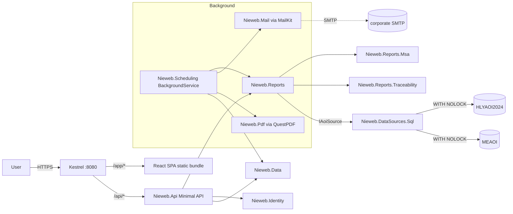

# Phase 2 — feature parity with Vieweb 1.6.2

_Status: **PROPOSAL** — awaiting sign-off._
_Depends on: `docs/tech-stack.md` (SIGNED-OFF 2026-07-20)._
_Successor of: `docs/phase-1-mvp.md`._

## 1. Purpose

Phase 1 shipped a single report end-to-end plus the full production
stack (auth, i18n, deployment, CI, audit). Phase 2 uses that vertical
slice as a template to reach **numeric feature parity** with the
Vieweb 1.6.2 report catalogue so line and quality engineers can retire
the legacy Tomcat 7 install.

Non-goals (deferred to Phase 3): the Sigmalink CAD editor, real-time
feedforward (SigmaLine), full Review / repair workflow, and the four
Sigmalink Analyse dashboards. Those are large enough to deserve their
own phase document.

---

## 2. Scope

### 2.1 Vieweb entity types delivered

Vieweb organised every report as one or more **entities** of the
following types (see the `vieweb-legacy` skill for the full domain
model). Phase 2 delivers Nieweb equivalents of the four that carry
production-critical KPIs plus the two supporting types:

| Vieweb entity | Nieweb report | KPI source | Uses |
|---|---|---|---|
| `templatetable` (FPY / DPMO) | **FPY table** (per AOI / product; panel or board) + **DPMO table** (per AOI / defect / JEDEC / part number / product / reference designator) | `PANELS`, `CARDS`, `TESTED_OBJECT` | Quality reviews, morning meetings. |
| `templategraph` (Error / Deviation / Trend) | **Pareto** error chart (top-N defects by day / shift / top-10), **Deviation** chart (X / Y / Z / surface / theta with ±tolerance / average / ±3σ overlays), **Trend** chart (Cp, Cpk, DPMO*, FPY* over 1h / 3h / 6h / 12h / shift / day / week / month) | `TESTED_OBJECT`, `PIN`, `PIN_MEASURE` (post-reflow only) | Line-side troubleshooting, drift detection. |
| `templatemsa` (Capability / Repeatability / Reproducibility) | **MSA** report (Cp, Cpk, EV, %EV, GR&R) on `Reference Designator` or `Package` over Deviation X / Y / Theta | `PIN_MEASURE` on a dedicated MSA source | Machine acceptance, calibration audits. |
| `templateprocesscapability` | **Process Capability** dashboard per production line (any of Cp/Cpk compo & paste, DPMO, FPY_Diag, Machine efficiency, Avg cycle duration, Nb inspections) | `PANELS`, `CARDS`, `TESTED_OBJECT` grouped by `PRODUCTION_LINE` | Weekly line reviews, Six-Sigma tracking. |
| `templatecomment` | **Comment block** entity (free-text, included in exports) | — | Report narration. |
| `TracabilityEntity` | **Traceability** drill-down (panel-level → subpanel → tested object → pin, plus per-board views) | All PANELS / CARDS / TESTED_OBJECT / PIN | Genealogy questions ("where did this board go?"). |

`TestEmptyMasterEntity` is intentionally out of scope: it requires a
dedicated Superviseur DB fed with empty-panel inspections and no
Nieweb user has asked for it in the design-partner interviews.

### 2.2 Cross-cutting features

- **Reports & report groups.** A *report* is a saved bundle of
  entities + filters + layout. *Report groups* organise them in the
  home page navigator. Both are per-user; Author role can share.
- **Filters.** Reproduce the Vieweb filter grammar (see `vieweb-legacy`
  §Features/Filter operators): `Equal`, `Different`, `In`, `Not In`,
  `Like`, `Not Like`, `Between`, `Not Between`, `≤`, `≥`. Board number
  / panel bar code / board ID code / reference designator / product /
  JEDEC / P&P machine / P&P sub-element 1–4 / part number / inspected
  object / repair status / default / repair comment / panel status /
  board status / AOI. `IN` uses `;` as separator.
- **Locked reports.** Author can password-lock a report; anyone can
  `Duplicate` a locked report to edit a copy.
- **Print.** Server renders a printable page (already done for
  Panel-Yield in F9); extend the same pattern to every entity.
- **Excel export.** One tab per entity; skip comment entities. XLSX
  via ClosedXML (already wired in R5).
- **CSV export** per entity table (already done for Panel-Yield).
- **PDF export.** New. Recommend **QuestPDF** — MIT, pure C#,
  render-server-side; wire the same layout data used by print CSS.
- **Automatic treatments.** Daily / weekly / monthly scheduled runs of
  a saved report; each run can email the Excel attachment via SMTP
  and/or write it to a configured directory. Global master switch +
  refresh frequency (Vieweb default 1440 min = 24 h). See §5.
- **Application parameters.** MSA thresholds (Acceptable / Out for
  Average, StdDev, 6σ, Cp, GR&R, EV, %EV on Deviation X / Y / Theta);
  tolerance intervals (`ITx`, `ITy`, `ITS` for pads + components);
  `GR_R` constant (default 4.33); confidence coefficient. Managed in
  the admin UI; persisted in the Nieweb internal DB. See `aoi-quality-
  metrics` skill for the formulas — do NOT re-derive.
- **Production lines & shifts.** Admin-managed logical grouping of
  machines into production lines (with order + category + image), plus
  24-hour shift breakpoints (Vieweb `shiftunit`). Needed by Process
  Capability and the "By shift" axis of the Error chart.
- **Home page.** User picks the subset of reports pinned to their
  dashboard (Vieweb `user_report`).

### 2.3 Fixes for legacy known bugs

Explicit acceptance test in Phase 2 CI:

- **#9699** — email delivery must succeed for every scheduled report
  or surface a clear error in the automatic-treatment audit row.
- **#12421** — weekly report totals must equal the sum of the daily
  totals over the same window (round-trip test).
- **#11211** — defect-name lookup must key on the exact
  `Error_Table` / `Error_Table_AR` bit that fired, not a positional
  join. Snapshot test on a fixture with several concurrent defect
  bits.
- **#18915** — no 250-column cap on any export; reproduce a >250-
  column DPMO table and verify XLSX + CSV both round-trip cleanly.

---

## 3. Success criteria (definition of done)

1. **Numeric parity.** For each report type, fixed reference windows
   on both Superviseur DBs produce KPI values within rounding error
   of hand-computed values from raw SQL (snapshot-tested in CI, same
   pattern as R2).
2. **Bug fixes verified.** #9699 / #12421 / #11211 / #18915 have
   dedicated regression tests that would have caught the legacy
   behaviour.
3. **Scheduled runs.** A weekly automatic treatment scheduled at
   Monday 06:00 for the last full week runs unattended for four
   consecutive weeks against the staging DB and emails / saves the
   XLSX every time.
4. **Read-only discipline preserved.** No new code path writes to
   either Superviseur DB. Every SQL statement is still captured in
   the per-query audit log with source tag, duration, and row count.
5. **CI green** on every push: `dotnet build`, `dotnet test`,
   `npm ci && npm run build && npm run lint && npm run test`, one
   Playwright end-to-end smoke covering each report type.
6. **Docs.** `docs/phase-2.md` (this document) supplemented by
   `docs/reports.md` — one section per report type describing the
   underlying SQL and the KPIs it computes.

Explicitly **not** a success criterion: matching Vieweb's UI pixel-
by-pixel. Phase 2 targets the Mantine + ECharts idiom already
established in Phase 1.

---

## 4. New components coming online

| Project | Purpose |
|---|---|
| `src/Nieweb.Reports/` | Grows to hold every report class. Each report is a pure function from `(IAoiSource, FilterDto, AppParameters)` → typed result DTO. |
| `src/Nieweb.Reports.Msa/` (new) | MSA-specific arithmetic (Cp, Cpk, EV, %EV, GR&R). Split out because the formulas are shared between the MSA entity and the Deviation chart's `±3σ` overlay. |
| `src/Nieweb.Reports.Traceability/` (new) | Panel → board → object → pin drill-down; kept separate because it exercises the optional `IPinLevelSource` capability and is post-reflow only. |
| `src/Nieweb.Scheduling/` (new) | Automatic-treatment scheduler. Built on `Microsoft.Extensions.Hosting.BackgroundService`; persists next-run timestamps in the internal DB (`AutomaticTreatment` table). Skips runs when the master switch is off (parity with Vieweb `batchIsOn`). |
| `src/Nieweb.Mail/` (new) | SMTP client wrapper around `MailKit`. Delivery is idempotent per `(treatmentId, runTimestamp)` — retries do not duplicate. |
| `src/Nieweb.Pdf/` (new) | QuestPDF layout templates shared by every report type (header / footer / dynamic single vs. two-column). |
| `src/Nieweb.Web/` | Grows: one route per report type plus admin pages for report groups, automatic treatments, production lines, shifts, MSA thresholds, tolerance intervals. |

The internal-DB schema (`Nieweb.Data`) gains:

- `Report` + `ReportGroup` + `ReportEntity` (an entity slot inside a
  report, referencing one of the six entity types via a discriminator).
- `Filter` + `FilterValue` (multi-value IN / BETWEEN).
- `AutomaticTreatment` (frequency, next-run, mail-flag, file-flag,
  FK to `Report` and `User`, plus per-run audit rows).
- `EmailRecipient` (m:n on `AutomaticTreatment`).
- `ProductionLine` + `LineMachine` + `Shift`.
- `AppParameter` (typed key/value; MSA thresholds, tolerance
  intervals, GR\_R, confidence coefficient live here).
- `HomeReport` (per-user pinned subset).

Every new entity is created via EF Core migrations (same dual-provider
Npgsql/Sqlite story as Phase 1).

---

## 5. Automatic treatments — design brief

- **Trigger.** `BackgroundService` wakes every N minutes (default 5;
  configurable, matches the Vieweb minimum granularity). It runs any
  treatment whose `NextRunUtc ≤ now && isEnabled`.
- **Isolation.** Each run happens in its own scope with a fresh
  `NiewebDbContext`. Long-running SQL against the Superviseur DBs is
  guarded by the same `SqlServerAoiSourceBase` read-only discipline
  (`WITH (NOLOCK)`, 30 s timeout, per-query audit log, cancellation
  token propagates).
- **Rescheduling.** On success, `NextRunUtc` is advanced by the
  frequency; on failure, it is advanced too (so we don't hot-loop) and
  a `TreatmentFailed` audit row is written with the exception summary.
- **Delivery.** File output writes to a configured directory
  (`Nieweb:BatchOutputDirectory`, default `%ProgramData%\Nieweb\batch`).
  Email delivery goes through `Nieweb.Mail`. Both actions are
  independent: a treatment may enable neither, either, or both.
- **Master switch.** Global `Nieweb:Batch:Enabled` in the internal
  `AppParameter` table (parity with Vieweb `batchIsOn`). Admin UI
  toggles it.
- **Concurrency.** Only one instance of a given treatment runs at a
  time (row-level lease with `SELECT ... FOR UPDATE SKIP LOCKED` on
  Postgres; equivalent guard on SQLite via a service-wide
  `SemaphoreSlim`).
- **Bug #9699 mitigation.** Every delivery attempt is a first-class
  audit row (`automatictreatment.delivery.ok`,
  `automatictreatment.delivery.failed`) with the SMTP transcript
  (headers only) attached. The admin UI surfaces failed treatments so
  they can't silently rot.

---

## 6. Architecture overview

The Phase 1 architecture stays intact — Phase 2 grows sideways
(more report projects, a scheduler, mail/PDF sidecars) rather than
rewiring existing layers.

---

## 7. Backlog

Ordered by dependency, T-shirt sized. Nothing here is estimated in
time — sequence matters more than clock estimates.

### 7.1 Report infrastructure (M)

- `RI1` — Extract the Phase-1 `PanelYieldByLineReport` pattern into a
  shared `IReport<TInput,TOutput>` contract with snapshot-test scaffold.
- `RI2` — `Nieweb.Reports.Common`: shared shift bucketing, time-window
  decomposition (1h / 3h / 6h / 12h / shift / day / week / month), and
  the aggregation helpers Vieweb calls "analyzed by".
- `RI3` — `AppParameters` service + `AppParameter` entity + admin CRUD.
- `RI4` — Filter grammar in `Nieweb.Filters` (typed DTO + operator
  enum + validator). Reproduces the Vieweb operator table verbatim.

### 7.2 Table reports (M)

- `TR1` — **FPY table** (panel + board flavours, per AOI / per product).
  Snapshot tests on both DBs.
- `TR2` — **DPMO table** (per AOI / defect / JEDEC / part number /
  product / reference designator; optional package / error-type / after-
  diagnostic detail columns). Uses the `Error_Table` / `Error_Table_AR`
  bit-decoding described in the `vit-aoi-database` skill.
- `TR3` — CSV + XLSX + PDF export for every table entity. **#18915
  regression test** on a >250-column DPMO table.

### 7.3 Chart reports (M)

- `CR1` — **Pareto** (Error) chart with day / shift / top-10 grouping,
  histogram + table representation, DPMO / PPM / real-value scales.
- `CR2` — **Deviation** chart on X / Y / Z / surface / theta with
  `±tolerance`, average, `±3σ` overlays; tolerance intervals sourced
  from `AppParameter`.
- `CR3` — **Trend** chart with time-bucket decomposition; supports
  Cp, Cpk, DPMO\*, FPY\*, panel vs board. Reuse `RI2` bucketing.

### 7.4 MSA + Process Capability (L)

- `MSA1` — Cp / Cpk / EV / %EV / GR&R arithmetic in
  `Nieweb.Reports.Msa` with unit-tested formulas (parity with
  `aoi-quality-metrics` skill).
- `MSA2` — MSA report UI + admin-managed thresholds (Acceptable / Out
  per metric × axis).
- `PC1` — Process Capability dashboard: per production line grid of Cp
  compo / paste, Cpk compo / paste, DPMO, FPY_Diag, Machine efficiency,
  Avg cycle duration, Nb inspections. Depends on `PL1`.
- `PL1` — Production line + machine grouping + shift breakpoints, EF
  entities + admin CRUD.

### 7.5 Traceability (M)

- `TC1` — Panel-level drill-down: panel → subpanel → tested object →
  pin (post-reflow / `IPinLevelSource` only).
- `TC2` — Per-board drill-down (both DBs).
- `TC3` — Panel-bar-code lookup entry point on the home page + saved-
  view integration.

### 7.6 Report composition (M)

- `RC1` — `Report` + `ReportGroup` + `ReportEntity` entities and admin
  CRUD.
- `RC2` — Report editor SPA route: pick entities from a palette, drop
  onto a canvas, edit filters per entity, save.
- `RC3` — Locked reports (owner-set password; anyone can Duplicate).
- `RC4` — Home-page pinning (`HomeReport`).
- `RC5` — Print / XLSX / PDF at report level (multi-entity).
- `RC6` — Comment entity (free-text markdown).

### 7.7 Automatic treatments (M)

- `AT1` — `Nieweb.Scheduling` BackgroundService + `AutomaticTreatment`
  entity + concurrency lease.
- `AT2` — `Nieweb.Mail` (MailKit) with per-attempt audit rows. **#9699
  regression test.**
- `AT3` — File-output batch to configured directory.
- `AT4` — Admin UI: schedule + recipients + enable/disable + master
  switch + failure inspector.
- `AT5` — **#12421 regression test**: assert weekly totals == sum of
  daily totals over the same window.

### 7.8 Defect bit fixes (S)

- `DB1` — Central `DefectBitDecoder` service keyed on `Error_Table` /
  `Error_Table_AR` bits per the `vit-aoi-database` skill (the source
  of truth for every macro type, foreign material, etc.).
- `DB2` — **#11211 regression test** on a synthetic panel with several
  concurrent defect bits.

### 7.9 Frontend (M)

- `F10` — Reusable "report canvas" component (drag-drop entities).
- `F11` — Filter builder component honouring the operator matrix.
- `F12` — Time-decomposition selector shared by every chart.
- `F13` — Admin pages: production lines / shifts / app parameters /
  automatic treatments / MSA thresholds / tolerance intervals.
- `F14` — Home-page pin/unpin.
- `F15` — PDF preview modal.

### 7.10 Deployment & ops (S)

- `O5` — SMTP configuration + secret rotation guidance in
  `docs/deploy.md`.
- `O6` — `%ProgramData%\Nieweb\batch` writable-directory bootstrap in
  `install-service.ps1`.
- `O7` — Metrics: `/health/scheduler` reports lag (max NextRunUtc
  overdue) + last-run outcomes.

### 7.11 Test coverage (S)

- `T3` — Per-report snapshot fixtures (RI1 scaffold, one per report
  type × two DBs).
- `T4` — Playwright happy-path smoke per report type.
- `T5` — Scheduler integration test: enable a fake treatment with a
  1-minute cadence and assert two consecutive runs write audit rows.

### 7.12 Design-partner integration (S, ongoing)

- Continues Phase 1 §7.8 with the same 2 line engineers. Phase 2 adds
  monthly demos of new report types until parity is reached.

---

## 8. Risks & mitigations

| Risk | Likelihood | Impact | Mitigation |
|---|---|---|---|
| Numeric drift vs. Vieweb because of different aggregation ordering (e.g. panel vs. board FPY denominator) | Medium | High — engineers will not trust Nieweb without parity | Every report has a snapshot test hand-verified against raw SQL and against a Vieweb export of the same window. |
| SQL performance regression on the Superviseur DBs (Phase 2 grows the query surface significantly) | Medium | High — could stall the SMT line | Every new query goes through the same `SqlServerAoiSourceBase` guards. Add a p95 query-duration budget per query kind (30 s hard limit stays, warn at 5 s). |
| MSA formula ambiguity (multiple published `GR&R` conventions) | Medium | Medium | Pin the formulas to the VIT-defined constants in `aoi-quality-metrics`; unit-test with the reference values from the Vieweb user guide §2.4. |
| SMTP outages produce silent report loss | Medium | Medium | Every attempt writes an audit row; failed treatments surface in the admin UI; retry policy with exponential back-off. |
| PDF output diverges from print CSS | Low | Low | QuestPDF templates share the same layout data DTO as print CSS; single source of truth for header / footer / column layout. |
| Scope creep pulls in Sigmalink features prematurely | High | Medium | Phase 2 is Vieweb-only. Sigmalink Analyse + Review are Phase 3. Any feature request beyond §2.1 / §2.2 goes into `docs/phase-3.md` (not this document). |

---

## 9. Deferred to Phase 3

- Sigmalink Analyse dashboards (Live / Line Performance / Product /
  Panel / Cp-Cpk) with DBQuery Pi/K.
- Full Sigmalink Review UI (inline / offline / remote / repair /
  dual-lane).
- CAD editor replacement (browser-native, replaces the JNLP applet).
- SigmaLine real-time feedforward.
- Test Empty Master entity.
- PI-Capacity guard (needed only when we start issuing DBQuery-Pi
  requests, which land with the Analyse dashboards).
- Additional locales beyond EN + FR (DE / ES / ZH — matches Sigmalink
  1.6.5 locale set).

---

## 10. Open questions (must be resolved before sign-off)

1. **MSA source DB.** Vieweb required a *dedicated* DB for MSA
   (empty-panel inspections). Do we already have one on-site, or does
   MSA wait until it can be commissioned?
2. **SMTP host + credentials.** Corporate relay or per-app credential?
   Determines whether `Nieweb.Mail` uses anonymous submission or a
   secret pulled from Windows-DPAPI / Entra.
3. **PDF footer branding.** Vieweb allowed 3 header + 3 footer slots
   (`logo`, `title`, `date`, `description`, `user`). Do we keep this
   configurability or bake a fixed corporate template?
4. **Report locking authorisation model.** Do we allow any Author to
   Duplicate a locked report (Vieweb behaviour), or should the lock
   also gate Duplicate?
5. **Automatic-treatment master switch scope.** Global on/off (Vieweb
   parity) or per-treatment only? Global is simpler; per-treatment is
   the modern norm.
