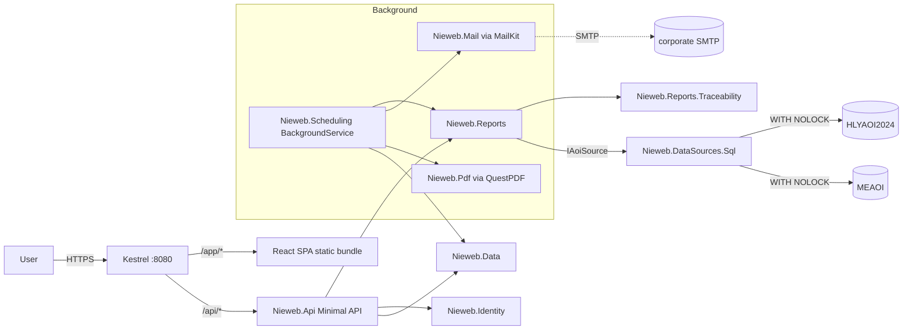

# Phase 2 — feature parity with Vieweb 1.6.2

_Status: **IN PROGRESS** — report infrastructure (§7.1), FPY table
(§7.2 TR1), DPMO table + Pareto server side (§7.2 TR2), Pareto SPA
page (§7.3 CR1), DefectBitDecoder + #11211 (§7.8), and corporate
branding (§11.2) have shipped. See §7 for the per-item status snapshot._
_Depends on: `docs/tech-stack.md` (SIGNED-OFF 2026-07-20)._
_Successor of: `docs/phase-1-mvp.md`._

## 1. Purpose

Phase 1 shipped a single report end-to-end plus the full production
stack (auth, i18n, deployment, CI, audit). Phase 2 uses that vertical
slice as a template to reach **numeric feature parity** with the
Vieweb 1.6.2 report catalogue so line and quality engineers can retire
the legacy Tomcat 7 install.

Non-goals (deferred to Phase 3): the Sigmalink CAD editor, real-time
feedforward (SigmaLine), full Review / repair workflow, and the four
Sigmalink Analyse dashboards. Those are large enough to deserve their
own phase document.

---

## 2. Scope

### 2.1 Vieweb entity types delivered

Vieweb organised every report as one or more **entities** of the
following types (see the `vieweb-legacy` skill for the full domain
model). Phase 2 delivers Nieweb equivalents of the four that carry
production-critical KPIs plus the two supporting types:

| Vieweb entity | Nieweb report | KPI source | Uses |
|---|---|---|---|
| `templatetable` (FPY / DPMO) | **FPY table** (per AOI / product; panel or board) + **DPMO table** (per AOI / defect / JEDEC / part number / product / reference designator) | `PANELS`, `CARDS`, `TESTED_OBJECT` | Quality reviews, morning meetings. |
| `templategraph` (Error / Deviation / Trend) | **Pareto** error chart (top-N defects by day / shift / top-10), **Deviation** chart (X / Y / Z / surface / theta with ±tolerance / average / ±3σ overlays), **Trend** chart (Cp, Cpk, DPMO*, FPY* over 1h / 3h / 6h / 12h / shift / day / week / month) | `TESTED_OBJECT`, `PIN`, `PIN_MEASURE` (post-reflow only) | Line-side troubleshooting, drift detection. |
| `templatemsa` (Capability / Repeatability / Reproducibility) | **Deferred** — MSA requires a dedicated Superviseur DB fed with empty-panel inspections that is not yet commissioned on site. Revisited when that DB is available. | — | — |
| `templateprocesscapability` | **Process Capability** dashboard per production line (Cp/Cpk compo & paste rows use a placeholder when no MSA source is bound; DPMO, FPY_Diag, Machine efficiency, Avg cycle duration, Nb inspections always render) | `PANELS`, `CARDS`, `TESTED_OBJECT` grouped by `PRODUCTION_LINE` | Weekly line reviews, Six-Sigma tracking. |
| `templatecomment` | **Comment block** entity (free-text, included in exports) | — | Report narration. |
| `TracabilityEntity` | **Traceability** drill-down (panel-level → subpanel → tested object → pin, plus per-board views) | All PANELS / CARDS / TESTED_OBJECT / PIN | Genealogy questions ("where did this board go?"). |

`TestEmptyMasterEntity` is intentionally out of scope: it requires a
dedicated Superviseur DB fed with empty-panel inspections and no
Nieweb user has asked for it in the design-partner interviews. The
MSA report shares that dedicated-DB requirement and is therefore
deferred alongside it (see §10 Q1).

### 2.2 Cross-cutting features

- **Reports & report groups.** A *report* is a saved bundle of
  entities + filters + layout. *Report groups* organise them in the
  home page navigator. Both are per-user; Author role can share.
- **Filters.** Reproduce the Vieweb filter grammar (see `vieweb-legacy`
  §Features/Filter operators): `Equal`, `Different`, `In`, `Not In`,
  `Like`, `Not Like`, `Between`, `Not Between`, `≤`, `≥`. Board number
  / panel bar code / board ID code / reference designator / product /
  JEDEC / P&P machine / P&P sub-element 1–4 / part number / inspected
  object / repair status / default / repair comment / panel status /
  board status / AOI. `IN` uses `;` as separator.
- **Locked reports.** Author can password-lock a report; the password
  blocks editing / deletion only. **Anyone can `Duplicate` a locked
  report without the password** (parity with Vieweb), and the copy is
  owned by the duplicator with no lock inherited.
- **Print.** Server renders a printable page (already done for
  Panel-Yield in F9); extend the same pattern to every entity.
- **Excel export.** One tab per entity; skip comment entities. XLSX
  via ClosedXML (already wired in R5).
- **CSV export** per entity table (already done for Panel-Yield).
- **PDF export.** New. Recommend **QuestPDF** — MIT, pure C#,
  render-server-side; wire the same layout data used by print CSS.
  Uses the **fixed corporate template** described in §11 (Nieweb
  header logo + BSS Green Premium sub-brand under it, footer with
  page N of M + generation timestamp + user). Vieweb's per-report
  header/footer slot configuration is dropped.
- **Automatic treatments.** Daily / weekly / monthly scheduled runs
  of a saved report; each run can email the Excel attachment via SMTP
  and/or write it to a configured directory. Two independent switches
  (Vieweb only had the global one — we add the per-treatment flag as
  the modern norm): a **global** `Nieweb:Batch:Enabled` master switch
  (parity with Vieweb `batchIsOn`), plus a per-`AutomaticTreatment`
  `IsEnabled` flag. A run fires only when both are on. Refresh
  frequency default 1440 min = 24 h. See §5.
- **Application parameters.** Tolerance intervals (`ITx`, `ITy`,
  `ITS` for pads + components); `GR_R` constant (default 4.33);
  confidence coefficient. Managed in the admin UI; persisted in the
  Nieweb internal DB. See `aoi-quality-metrics` skill for the formulas
  — do NOT re-derive. **MSA thresholds** (Acceptable / Out for
  Average, StdDev, 6σ, Cp, GR&R, EV, %EV on Deviation X / Y / Theta)
  are deferred with the MSA report itself.
- **Production lines & shifts.** Admin-managed logical grouping of
  machines into production lines (with order + category + image), plus
  24-hour shift breakpoints (Vieweb `shiftunit`). Needed by Process
  Capability and the "By shift" axis of the Error chart.
- **Home page.** User picks the subset of reports pinned to their
  dashboard (Vieweb `user_report`).

### 2.3 Fixes for legacy known bugs

Explicit acceptance test in Phase 2 CI:

- **#9699** — email delivery must succeed for every scheduled report
  or surface a clear error in the automatic-treatment audit row.
- **#12421** — weekly report totals must equal the sum of the daily
  totals over the same window (round-trip test).
- **#11211** — defect-name lookup must key on the exact
  `Error_Table` / `Error_Table_AR` bit that fired, not a positional
  join. Snapshot test on a fixture with several concurrent defect
  bits.
- **#18915** — no 250-column cap on any export; reproduce a >250-
  column DPMO table and verify XLSX + CSV both round-trip cleanly.

---

## 3. Success criteria (definition of done)

1. **Numeric parity.** For each report type, fixed reference windows
   on both Superviseur DBs produce KPI values within rounding error
   of hand-computed values from raw SQL (snapshot-tested in CI, same
   pattern as R2).
2. **Bug fixes verified.** #9699 / #12421 / #11211 / #18915 have
   dedicated regression tests that would have caught the legacy
   behaviour.
3. **Scheduled runs.** A weekly automatic treatment scheduled at
   Monday 06:00 for the last full week runs unattended for four
   consecutive weeks against the staging DB and emails / saves the
   XLSX every time.
4. **Read-only discipline preserved.** No new code path writes to
   either Superviseur DB. Every SQL statement is still captured in
   the per-query audit log with source tag, duration, and row count.
5. **CI green** on every push: `dotnet build`, `dotnet test`,
   `npm ci && npm run build && npm run lint && npm run test`, one
   Playwright end-to-end smoke covering each report type.
6. **Docs.** `docs/phase-2.md` (this document) supplemented by
   `docs/reports.md` — one section per report type describing the
   underlying SQL and the KPIs it computes.

Explicitly **not** a success criterion: matching Vieweb's UI pixel-
by-pixel. Phase 2 targets the Mantine + ECharts idiom already
established in Phase 1.

---

## 4. New components coming online

| Project | Purpose |
|---|---|
| `src/Nieweb.Reports/` | Grows to hold every report class. Each report is a pure function from `(IAoiSource, FilterDto, AppParameters)` → typed result DTO. |
| `src/Nieweb.Reports.Traceability/` (new) | Panel → board → object → pin drill-down; kept separate because it exercises the optional `IPinLevelSource` capability and is post-reflow only. |
| `src/Nieweb.Scheduling/` (new) | Automatic-treatment scheduler. Built on `Microsoft.Extensions.Hosting.BackgroundService`; persists next-run timestamps in the internal DB (`AutomaticTreatment` table). Skips runs when the master switch is off or the per-treatment `IsEnabled` flag is off (parity with Vieweb `batchIsOn` plus a modern per-row toggle). |
| `src/Nieweb.Mail/` (new) | SMTP client wrapper around `MailKit`. Delivery is idempotent per `(treatmentId, runTimestamp)` — retries do not duplicate. |
| `src/Nieweb.Pdf/` (new) | QuestPDF layout templates implementing the fixed corporate template described in §11 (header + sub-brand + footer). Shared across every report type. |
| `src/Nieweb.Web/` | Grows: one route per report type plus admin pages for report groups, automatic treatments, production lines, shifts, tolerance intervals. |

The internal-DB schema (`Nieweb.Data`) gains:

- `Report` + `ReportGroup` + `ReportEntity` (an entity slot inside a
  report, referencing one of the six entity types via a discriminator).
- `Filter` + `FilterValue` (multi-value IN / BETWEEN).
- `AutomaticTreatment` (frequency, next-run, mail-flag, file-flag,
  `IsEnabled` per-treatment flag, FK to `Report` and `User`, plus
  per-run audit rows).
- `EmailRecipient` (m:n on `AutomaticTreatment`).
- `ProductionLine` + `LineMachine` + `Shift`.
- `AppParameter` (typed key/value; tolerance intervals, GR\_R,
  confidence coefficient live here; MSA thresholds land alongside
  them when the MSA report is undeferred).
- `HomeReport` (per-user pinned subset).

Every new entity is created via EF Core migrations (same dual-provider
Npgsql/Sqlite story as Phase 1).

---

## 5. Automatic treatments — design brief

- **Trigger.** `BackgroundService` wakes every N minutes (default 5;
  configurable, matches the Vieweb minimum granularity). It runs any
  treatment whose `NextRunUtc ≤ now && isEnabled && globalBatchEnabled`.
  Both switches must be on — the global switch is an ops kill-switch;
  the per-treatment flag is the day-to-day owner control.
- **Isolation.** Each run happens in its own scope with a fresh
  `NiewebDbContext`. Long-running SQL against the Superviseur DBs is
  guarded by the same `SqlServerAoiSourceBase` read-only discipline
  (`WITH (NOLOCK)`, 30 s timeout, per-query audit log, cancellation
  token propagates).
- **Rescheduling.** On success, `NextRunUtc` is advanced by the
  frequency; on failure, it is advanced too (so we don't hot-loop) and
  a `TreatmentFailed` audit row is written with the exception summary.
- **Delivery.** File output writes to a configured directory
  (`Nieweb:BatchOutputDirectory`, default `%ProgramData%\Nieweb\batch`).
  Email delivery goes through `Nieweb.Mail`. Both actions are
  independent: a treatment may enable neither, either, or both.
- **Master switch.** Global `Nieweb:Batch:Enabled` in the internal
  `AppParameter` table (parity with Vieweb `batchIsOn`). Admin UI
  toggles it. In parallel, each `AutomaticTreatment` row carries
  its own `IsEnabled` flag that the owning Author can toggle without
  Admin rights.
- **Concurrency.** Only one instance of a given treatment runs at a
  time (row-level lease with `SELECT ... FOR UPDATE SKIP LOCKED` on
  Postgres; equivalent guard on SQLite via a service-wide
  `SemaphoreSlim`).
- **Bug #9699 mitigation.** Every delivery attempt is a first-class
  audit row (`automatictreatment.delivery.ok`,
  `automatictreatment.delivery.failed`) with the SMTP transcript
  (headers only) attached. The admin UI surfaces failed treatments so
  they can't silently rot.

---

## 6. Architecture overview

The Phase 1 architecture stays intact — Phase 2 grows sideways
(more report projects, a scheduler, mail/PDF sidecars) rather than
rewiring existing layers.

---

## 7. Backlog

Ordered by dependency, T-shirt sized. Nothing here is estimated in
time — sequence matters more than clock estimates.

**Status legend.** Each item is annotated with one of:
`✅ done <sha>` — merged, tests green;
`🟡 partial <sha>` — some sub-items delivered, follow-ups called out;
`⬜ open` — not started.

**Progress snapshot (2026-07-21).** Report infra (§7.1) is fully
landed. Table reports (§7.2) are landed on the server + export
layers; the frontend and the #18915 regression are the remaining
gap. Chart reports (§7.3) have the Pareto flavour shipped end-to-end;
Deviation and Trend charts are not started. Nothing else in §7.4 –
§7.11 has code yet.

### 7.1 Report infrastructure (M)

- `RI1` ✅ done `b388960` — Extract the Phase-1 `PanelYieldByLineReport`
  pattern into a shared `IReport<TInput,TOutput>` contract with
  snapshot-test scaffold (`Nieweb.Reports.TestKit`).
- `RI2` ✅ done `8b3ee1d` — `Nieweb.Reports.Common`: shared shift
  bucketing, time-window decomposition (1h / 3h / 6h / 12h / shift /
  day / week / month), and the aggregation helpers Vieweb calls
  "analyzed by".
- `RI3` ✅ done `e8cacd5` — `AppParameters` service + `AppParameter`
  entity + admin CRUD.
- `RI4` ✅ done `3bbea1a` — Filter grammar in `Nieweb.Filters` (typed
  DTO + operator enum + validator). Reproduces the Vieweb operator
  table verbatim.

### 7.2 Table reports (M)

- `TR1` ✅ done `52e8a2b` — **FPY table** (panel + board flavours,
  per AOI / per product). Snapshot tests on both DBs.
- `TR2` ✅ done `47df7e7` — **DPMO table** (per AOI / defect / JEDEC /
  part number / product / reference designator; optional package /
  error-type / after-diagnostic detail columns). Uses the
  `Error_Table` / `Error_Table_AR` bit-decoding described in the
  `vit-aoi-database` skill. Endpoints wired in `5bc39a6`.
- `TR3` 🟡 partial `a01475c` — CSV + XLSX exports for DPMO and Pareto
  endpoints landed. **Still open:** PDF export for every table
  entity, and the **#18915 regression test** on a >250-column DPMO
  table (no test currently asserts the cap is gone).

### 7.3 Chart reports (M)

- `CR1` 🟡 partial `03a544e` — **Pareto** (Error) chart shipped as a
  SPA page (`/report/pareto`) with histogram + cumulative-percent
  overlay + drill-down table, plus the CSV/XLSX exports from `TR3`.
  **Still open:** day / shift / top-10 grouping selector, DPMO / PPM
  / real-value scale toggles (the current chart is fixed to the
  post-review "real defects" numerator).
- `CR2` ⬜ open — **Deviation** chart on X / Y / Z / surface / theta
  with `±tolerance`, average, `±3σ` overlays; tolerance intervals
  sourced from `AppParameter`.
- `CR3` ⬜ open — **Trend** chart with time-bucket decomposition;
  supports Cp, Cpk, DPMO\*, FPY\*, panel vs board. Reuse `RI2`
  bucketing.

### 7.4 Process Capability (M)

- `PC1` ⬜ open — Process Capability dashboard: per production line
  grid of DPMO, FPY_Diag, Machine efficiency, Avg cycle duration,
  Nb inspections. The Cp/Cpk compo & paste rows render a "MSA source
  not configured" placeholder until the dedicated MSA DB is
  commissioned (see §10 Q1). Depends on `PL1`.
- `PL1` ⬜ open — Production line + machine grouping + shift
  breakpoints, EF entities + admin CRUD.

> **MSA report deferred.** The `templatemsa` entity (Cp / Cpk / EV /
> %EV / GR&R on a dedicated empty-panel DB) is not delivered in
> Phase 2. When the MSA source is commissioned we revive a
> `Nieweb.Reports.Msa` project, an admin threshold-management page,
> and the corresponding admin-parameter rows.
### 7.5 Traceability (M)

- `TC1` ⬜ open — Panel-level drill-down: panel → subpanel → tested
  object → pin (post-reflow / `IPinLevelSource` only).
- `TC2` ⬜ open — Per-board drill-down (both DBs).
- `TC3` ⬜ open — Panel-bar-code lookup entry point on the home page
  + saved-view integration.

### 7.6 Report composition (M)

- `RC1` ⬜ open — `Report` + `ReportGroup` + `ReportEntity` entities
  and admin CRUD.
- `RC2` ⬜ open — Report editor SPA route: pick entities from a
  palette, drop onto a canvas, edit filters per entity, save.
- `RC3` ⬜ open — Locked reports (owner-set password; anyone can
  Duplicate).
- `RC4` ⬜ open — Home-page pinning (`HomeReport`).
- `RC5` ⬜ open — Print / XLSX / PDF at report level (multi-entity).
- `RC6` ⬜ open — Comment entity (free-text markdown).

### 7.7 Automatic treatments (M)

- `AT1` ⬜ open — `Nieweb.Scheduling` BackgroundService +
  `AutomaticTreatment` entity + concurrency lease.
- `AT2` ⬜ open — `Nieweb.Mail` (MailKit) with per-attempt audit rows.
  **#9699 regression test.** Blocked on §10.2 Q1 (SMTP host).
- `AT3` ⬜ open — File-output batch to configured directory.
- `AT4` ⬜ open — Admin UI: schedule + recipients + enable/disable +
  master switch + failure inspector.
- `AT5` ⬜ open — **#12421 regression test**: assert weekly totals ==
  sum of daily totals over the same window.

### 7.8 Defect bit fixes (S)

- `DB1` ✅ done `88b2ed7` — Central `DefectBitDecoder` service keyed
  on `Error_Table` / `Error_Table_AR` bits per the `vit-aoi-database`
  skill (the source of truth for every macro type, foreign material,
  etc.).
- `DB2` ✅ done `88b2ed7` — **#11211 regression test** on a synthetic
  panel with several concurrent defect bits.

### 7.9 Frontend (M)

- `F10` 🟡 partial `03a544e` — Reusable "report canvas" component
  (drag-drop entities). The Pareto page shipped a report-shaped
  layout (filter form + chart + drill-down table + export buttons)
  that will become the template for the canvas; the drag-drop editor
  itself is still open.
- `F11` ⬜ open — Filter builder component honouring the operator
  matrix.
- `F12` ⬜ open — Time-decomposition selector shared by every chart.
- `F13` ⬜ open — Admin pages: production lines / shifts / app
  parameters / automatic treatments / tolerance intervals. (§7.1
  RI3's admin CRUD covers `AppParameter` at the API layer; a
  dedicated SPA route is still pending.)
- `F14` ⬜ open — Home-page pin/unpin.
- `F15` ⬜ open — PDF preview modal.

### 7.10 Deployment & ops (S)

- `O5` ⬜ open — SMTP configuration + secret rotation guidance in
  `docs/deploy.md`. Blocked on §10.2 Q1.
- `O6` ⬜ open — `%ProgramData%\Nieweb\batch` writable-directory
  bootstrap in `install-service.ps1`.
- `O7` ⬜ open — Metrics: `/health/scheduler` reports lag (max
  NextRunUtc overdue) + last-run outcomes.

### 7.11 Test coverage (S)

- `T3` 🟡 partial — Per-report snapshot fixtures for the shipped
  reports (FPY table, DPMO table, Pareto) land alongside their
  respective commits via the `Nieweb.Reports.TestKit` scaffold from
  `RI1`. **Still open:** two-DB parity fixtures once `HlyaoiSource`
  and `MeaoiSource` have snapshot cassettes wired.
- `T4` ⬜ open — Playwright happy-path smoke per report type (the
  MVP smoke in `7005dd7` covers panel-yield only).
- `T5` ⬜ open — Scheduler integration test: enable a fake treatment
  with a 1-minute cadence and assert two consecutive runs write
  audit rows.

### 7.12 Design-partner integration (S, ongoing)

- Continues Phase 1 §7.8 with the same 2 line engineers. Phase 2 adds
  monthly demos of new report types until parity is reached.

---

## 8. Risks & mitigations

| Risk | Likelihood | Impact | Mitigation |
|---|---|---|---|
| Numeric drift vs. Vieweb because of different aggregation ordering (e.g. panel vs. board FPY denominator) | Medium | High — engineers will not trust Nieweb without parity | Every report has a snapshot test hand-verified against raw SQL and against a Vieweb export of the same window. |
| SQL performance regression on the Superviseur DBs (Phase 2 grows the query surface significantly) | Medium | High — could stall the SMT line | Every new query goes through the same `SqlServerAoiSourceBase` guards. Add a p95 query-duration budget per query kind (30 s hard limit stays, warn at 5 s). |
| SMTP outages produce silent report loss | Medium | Medium | Every attempt writes an audit row; failed treatments surface in the admin UI; retry policy with exponential back-off. |
| PDF output diverges from print CSS | Low | Low | QuestPDF templates share the same layout data DTO as print CSS; single source of truth for header / footer / column layout. |
| Scope creep pulls in Sigmalink features prematurely | High | Medium | Phase 2 is Vieweb-only. Sigmalink Analyse + Review are Phase 3. Any feature request beyond §2.1 / §2.2 goes into `docs/phase-3.md` (not this document). |

---

## 9. Deferred to Phase 3

- **MSA report** (Cp / Cpk / EV / %EV / GR&R on `Reference Designator`
  / `Package`) — requires a dedicated empty-panel Superviseur DB that
  is not yet commissioned on site. Revived alongside
  `Nieweb.Reports.Msa` when that DB exists.
- Sigmalink Analyse dashboards (Live / Line Performance / Product /
  Panel / Cp-Cpk) with DBQuery Pi/K.
- Full Sigmalink Review UI (inline / offline / remote / repair /
  dual-lane).
- CAD editor replacement (browser-native, replaces the JNLP applet).
- SigmaLine real-time feedforward.
- Test Empty Master entity.
- PI-Capacity guard (needed only when we start issuing DBQuery-Pi
  requests, which land with the Analyse dashboards).
- Additional locales beyond EN + FR (DE / ES / ZH — matches Sigmalink
  1.6.5 locale set).

---

## 10. Open questions

### 10.1 Resolved (2026-07-21)

1. **MSA source DB.** Deferred — no empty-panel Superviseur DB is
   available on site. The `templatemsa` entity, `Nieweb.Reports.Msa`,
   and the MSA-threshold admin page move to Phase 3 (§9). The
   Process Capability dashboard still ships in Phase 2 but its
   Cp/Cpk compo & paste rows render a "MSA source not configured"
   placeholder.
2. **PDF footer branding.** Fixed corporate template — no per-report
   header/footer slot configuration (drops Vieweb's `defaultHeaderLeft`
   / `defaultHeaderMiddle` / … knobs). See §11.
3. **Report locking authorisation model.** Vieweb parity — anyone can
   `Duplicate` a locked report without knowing the password. The lock
   only gates edit / delete on the original. The duplicated copy is
   owned by the duplicator with no lock inherited.
4. **Automatic-treatment master switch scope.** Both — keep the
   global `Nieweb:Batch:Enabled` kill switch (parity with Vieweb
   `batchIsOn`) and add a per-`AutomaticTreatment` `IsEnabled` flag.
   A run fires only when both are on.

### 10.2 Still open

1. **SMTP host + credentials.** Pending IT-department confirmation.
   Interim design: `Nieweb.Mail` is written against an
   `ISmtpDelivery` interface with a `MailKitSmtpDelivery`
   implementation that reads host / port / credentials from
   `appsettings.json` + `.env`. Both the anonymous-relay and
   authenticated-submission paths compile; the choice becomes an
   ops-time configuration only. Block `AT2` from going to production
   until this is confirmed.

---

## 11. Corporate branding

All assets live under `logo/` at the repo root and are shipped with
the SPA build.

| File | Usage |
|---|---|
| `logo/Nieweb_icon.svg` | Favicon (`<link rel="icon">`), PWA manifest icon, admin sign-in card. |
| `logo/logo.svg` | Primary Nieweb wordmark. Rendered in the AppShell header and at the top of every printed / PDF report. |
| `logo/bss_green_premium_no_pod.svg` | Parent-brand mark (BSS Green Premium). Rendered directly **beneath** `logo.svg` in the header (smaller, muted), and in the footer of every printed / PDF report. Kept unobtrusive so it doesn't compete with the primary wordmark on the home page. |
| `logo/tray_icon.svg` | Reserved for the Windows service tray icon (used only if the process ever runs as a foreground / interactive host; the current Windows-service host has no tray). |

### 11.1 Fixed report template (PDF + Print)

Both QuestPDF (`Nieweb.Pdf`) and the print CSS render every report
with the same fixed template:

- **Header:** `logo.svg` top-left, report title centred, generation
  timestamp top-right (short ISO date + user's locale time).
- **Sub-header strip:** `bss_green_premium_no_pod.svg` scaled to
  roughly one-third of the main logo, left-aligned, with a thin
  horizontal rule beneath it.
- **Body:** the report content (tables + charts + comments).
- **Footer:** `Nieweb  ·  Page N of M  ·  generated by <displayName>`
  centred, in muted grey. No per-report configuration.

Rationale: killing the 3×3 header/footer slot matrix from Vieweb
drops one of the most confusing Author-role settings in the legacy
UI and lets the branding evolve centrally.

### 11.2 SPA header placement

The existing Mantine `AppShell.Header` continues to show the app
title. Phase 2 replaces the plain `<Title order={3}>Nieweb</Title>`
with a small logo cluster: `logo.svg` at ~28 px, `bss_green_premium_
no_pod.svg` at ~14 px directly under it, both wrapped in a `<Link
to="/">` so clicking the mark goes home.
